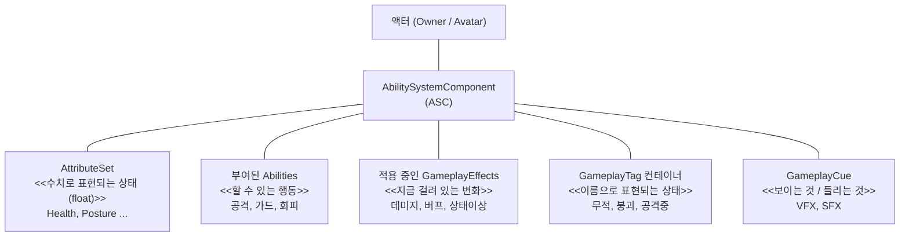
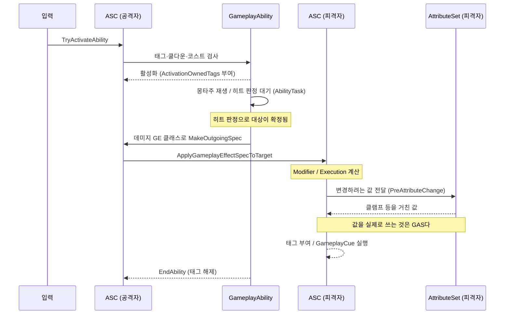
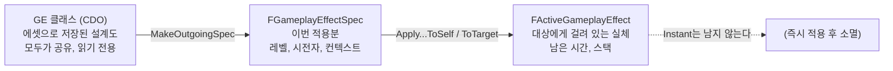
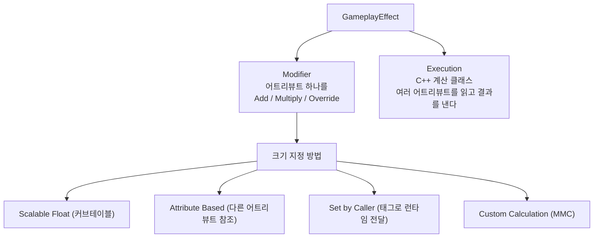

# 004 — GAS 구조 개요

- 기준 엔진: UE 5.8

---

## 1. 한 장 지도

ASC(AbilitySystemComponent)가 모든 것의 중심이다. 나머지는 전부 ASC에 붙어 있다.

한 줄 요약:

| 부품 | 맡는 일 | 비유 |
|---|---|---|
| **ASC** | 나머지를 전부 소유하고 중개한다 | 관리 창구 |
| **AttributeSet** | 숫자 상태를 들고 있다 | 스탯 시트 |
| **GameplayEffect (GE)** | 어트리뷰트와 태그를 **바꾸는 방법**을 정의한다 | 처방전 |
| **GameplayAbility** | 조건을 검사하고 절차를 실행한다 | 행동 대본 |
| **GameplayTag** | 상태를 이름으로 표시하고 서로를 막거나 허용한다 | 이름표 |
| **GameplayCue** | 게임플레이 결과를 보이고 들리게 한다 | 연출 |

**핵심 분업: 어빌리티는 "무엇을 할지"를 정하고, GE는 "값을 어떻게 바꿀지"를 정한다.**
어빌리티가 직접 체력을 깎지 않는다.

## 2. 공격 한 번의 흐름

가정한 상황: **근접 공격이 대상 한 명을 맞혔을 때.**

**ASC가 AttributeSet의 값을 직접 대입하지 않는다.**
GE의 Modifier·Execution 결과를 GAS가 집계해 새 값을 만들고, AttributeSet은 그 값이 쓰이기 전에
검사·보정하는 훅(`PreAttributeChange` 등)으로 참여한다. 그래서 클램프 같은 규칙을
AttributeSet 한 곳에 두면 어떤 GE가 와도 지켜진다.

## 3. 클래스 → Spec → ActiveGameplayEffect

GE를 다룰 때 헷갈리는 세 단계다. [GE 에셋은 인스턴스가 아니라 클래스(CDO)다](002-class-default-object.md#gameplayeffect는-인스턴스-없이-cdo를-쓴다)에서 이어진다.

지속 방식은 세 가지다 (`GameplayEffect.h:686-694`).

| DurationPolicy | 남는가 | 바꾸는 값 | 쓰임 |
|---|---|---|---|
| `Instant` | 안 남는다 | BaseValue | 데미지, 회복 |
| `HasDuration` | 시간 뒤 사라진다 | CurrentValue | 버프, 디버프, 일시 상태 |
| `Infinite` | 지울 때까지 남는다 | CurrentValue | 장비 보너스, 상시 상태 |

`Instant`와 나머지가 바꾸는 값이 다르다는 점이 중요하다. → [Instant와 Duration이 서로 다른 값을 바꾼다](005-attribute-change-pipeline.md#2-어느-ge가-어느-값을-바꾸는가).

## 4. GE가 값을 바꾸는 두 가지 방법

- **Modifier**: "이 어트리뷰트에 이만큼"처럼 단순한 변경.
- **Execution**: 공격력·방어력을 함께 읽어 최종 데미지를 내는 식의 계산.
- 주의: **같은 GE 안의 Modifier는 서로의 결과를 보지 못한다.** 캡처는 GE 실행 직전의 스냅샷이다.
  초기값 부여 GE에서 `Health`를 `MaxHealth` 기준으로 잡지 못하고, 어트리뷰트 다섯 개를 전부
  리터럴 값(커브테이블)으로 채운 이유가 이것이다 ([초기값 부여 GE에서 겪은 것](#7-현재-코드에-있는-것과-아직-없는-것)).

## 5. 태그의 네 가지 쓰임

GameplayTag는 계층형 이름(`State.Stagger`)일 뿐이지만, GAS에서 네 가지 역할을 한다.

| 쓰임 | 어디에 | 예 |
|---|---|---|
| **상태 표시** | ASC의 태그 컨테이너 | "지금 붕괴 상태다" |
| **활성화 제어** | 어빌리티의 `ActivationRequiredTags` / `ActivationBlockedTags` | "붕괴 중에는 공격 불가" |
| **행동 차단·취소** | 어빌리티의 `BlockAbilitiesWithTag` / `CancelAbilitiesWithTag` | "공격 중에는 회피 불가" |
| **분류 이름표** | 어빌리티의 Asset Tags (구 `AbilityTags`), GE의 태그들 | "이 어빌리티는 공격류다" |

- 어빌리티가 활성화되는 동안 `ActivationOwnedTags`가 소유자에게 자동으로 붙고, 끝나면 사라진다.
  → 상태 관리를 직접 하지 않아도 된다.
- `AbilityTags`는 UE 5.5부터 Asset Tags로 이름이 바뀌었다 (`GameplayAbility.h:474`).

## 6. 누가 실행하는가

[003 — 권한 모델과 리플리케이션](003-authority-and-replication.md)과 겹치는 부분. 한 문장으로: **결정은 서버, 표현은 모두.**

| 동작 | 실행 주체 |
|---|---|
| GE 적용, 어트리뷰트 변경 | 서버 |
| 어빌리티 활성화 | 클라이언트가 요청, 서버가 확정 (예측을 쓰면 클라이언트가 먼저 실행) |
| GameplayCue | 서버가 알리고 각 클라이언트가 재생 |

## 7. 현재 코드에 있는 것과 아직 없는 것

> 아직 만들지 않은 기능에 대한 예상은 적지 않는다. 구현한 뒤에 추가한다.

**있는 것**

| 부품 | 현재 상태 |
|---|---|
| ASC | `ABlademasterCharacter`에 부착. 플레이어·적 공용 |
| AttributeSet | `Health`, `MaxHealth`, `Posture`, `MaxPosture`, `BasePostureRegenRate` |
| GE | `GE_InitializeAttributes` 하나. 초기값 부여용 |
| Ability | 없음 |
| Tag | 프로젝트 태그 계층 없음 |
| Cue | 없음 |

**`GE_InitializeAttributes`에서 이미 겪은 것**

- Modifier 5개가 전부 `Override` + `Scalable Float`이고, 값은 `CT_InitialAttributes` 커브테이블에서 읽는다.
- 어트리뷰트끼리 참조하지 않고 전부 리터럴로 간 이유는 [같은 GE 안의 Modifier는 서로의 결과를 보지 못한다](#4-ge가-값을-바꾸는-두-가지-방법)는 점이다.
- Modifier 배열 순서가 `PreAttributeChange` 클램프에 영향을 준다. Max 계열이 먼저 와야 한다.
  → 왜 그런지는 [모디파이어 순서 문제의 원인](005-attribute-change-pipeline.md#모디파이어-순서-문제의-원인)에서 다룬다.

## 8. 용어 정리

| 용어 | 읽기 | 한 줄 |
|---|---|---|
| ASC | AbilitySystemComponent | GAS의 창구 컴포넌트 |
| Attribute | 어트리뷰트 | GAS가 관리하는 float 하나 |
| GE | GameplayEffect | 어트리뷰트·태그를 바꾸는 방법의 정의 |
| Spec | GameplayEffectSpec | 이번 한 번의 적용분 |
| Modifier | 모디파이어 | 어트리뷰트 하나를 바꾸는 단위 |
| Execution | 실행 계산 | 여러 값을 읽어 결과를 내는 계산 클래스 |
| Ability | GameplayAbility | 조건 검사 + 절차 실행 |
| AbilityTask | 어빌리티 태스크 | 어빌리티 안에서 기다리는 비동기 단계 (몽타주 등) |
| Cue | GameplayCue | 태그로 호출되는 연출 |

## 9. 엔진 소스 참고 (UE 5.8)

| 파일 | 위치 | 내용 |
|---|---|---|
| `.../Public/GameplayEffect.h` | 686-694 | `EGameplayEffectDurationType` |
| `.../Public/Abilities/GameplayAbility.h` | 474, 739-755 | Asset Tags 이름 변경, 활성화 관련 태그 프로퍼티 |
| `.../Private/AbilitySystemComponent.cpp` | 535 | GE 클래스에서 CDO를 꺼내 Spec을 만든다 |
