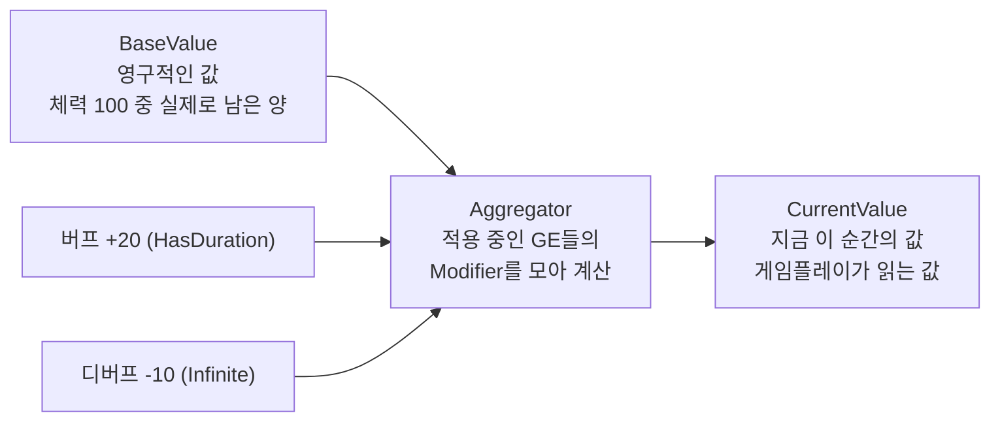
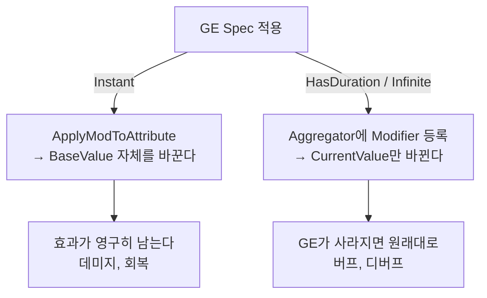
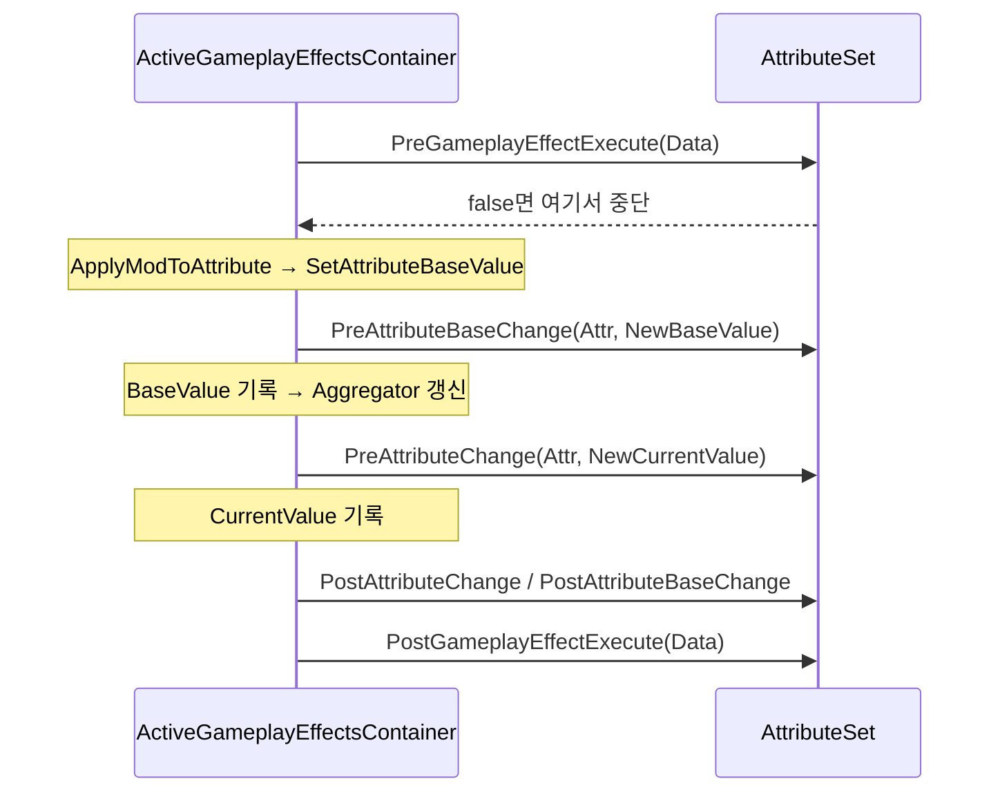
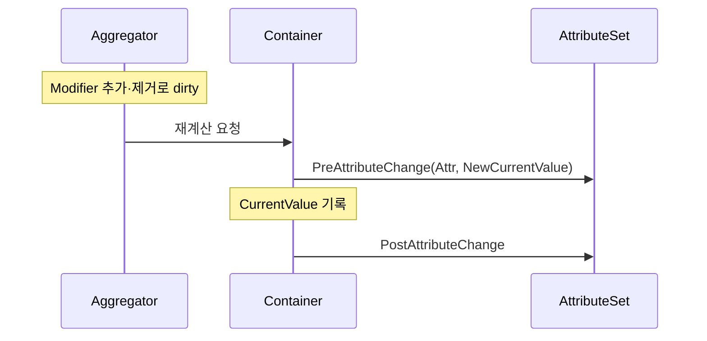
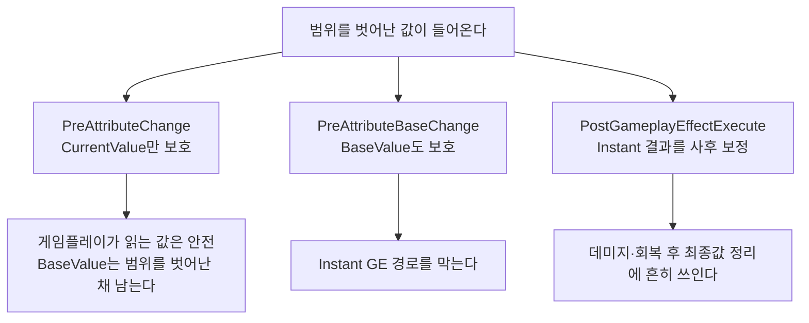
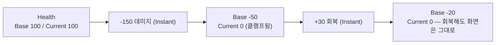

# 005 — 어트리뷰트 변경 파이프라인

- 기준 엔진: UE 5.8

---

## 1. 어트리뷰트에는 값이 두 개 있다

`FGameplayAttributeData`는 `BaseValue`와 `CurrentValue`를 따로 들고 있다.

- **CurrentValue = BaseValue에 지금 걸려 있는 모든 Modifier를 적용한 결과**다.
- 버프가 끝나면 그 Modifier가 빠지고 CurrentValue가 다시 계산된다. BaseValue는 건드려지지 않는다.
  → 버프를 "되돌리는" 코드를 직접 쓸 필요가 없는 이유.
- `ATTRIBUTE_ACCESSORS`가 만들어 주는 `GetHealth()`는 **CurrentValue**를 반환한다.

## 2. 어느 GE가 어느 값을 바꾸는가

| DurationPolicy | 바꾸는 값 | 사라질 때 |
|---|---|---|
| `Instant` | BaseValue | 되돌아가지 않는다 (애초에 남지 않는다) |
| `HasDuration` / `Infinite` | CurrentValue (Aggregator 경유) | 자동으로 되돌아간다 |

## 3. 훅은 네 개이고, 경로마다 다르게 불린다

### Instant GE (데미지·회복)

### Duration / Infinite GE, 그리고 GE가 사라질 때

**중요: 이 경로에는 `PreAttributeBaseChange`도, `Pre/PostGameplayEffectExecute`도 없다.**

| 훅 | 언제 | 값을 고칠 수 있나 |
|---|---|---|
| `PreGameplayEffectExecute` | Instant GE 실행 직전 | 적용 자체를 막을 수 있다 (false 반환) |
| `PreAttributeBaseChange` | BaseValue가 쓰이기 직전 | 된다 (`float&`) |
| `PreAttributeChange` | CurrentValue가 쓰이기 직전 | 된다 (`float&`) |
| `PostGameplayEffectExecute` | Instant GE 실행 직후 | 값을 다시 세팅해 보정할 수 있다 |

## 4. 클램프를 어디에 걸 것인가

**`PreAttributeChange` 하나만으로는 BaseValue를 지킬 수 없다.** [두 경로의 훅 시퀀스](#3-훅은-네-개이고-경로마다-다르게-불린다)를 비교하면 이유가 보인다.
BaseValue는 `PreAttributeBaseChange`를 지나서 기록되고, `PreAttributeChange`는 그 뒤에 계산된
CurrentValue에만 관여한다.

## 5. 현재 코드에서 확인한 것

[`UBlademasterAttributeSet`](../../Source/Blademaster/AbilitySystem/BlademasterAttributeSet.cpp)은
`PreAttributeChange`만 오버라이드하고 `Health`·`Posture`를 클램프한다.

### 확인 결과

- **CurrentValue는 안전하다.** 어떤 GE가 오더라도 `PreAttributeChange`를 지나므로 게임플레이가 읽는
  값은 항상 `[0, Max]` 안에 있다.
- **BaseValue는 범위를 벗어날 수 있다.** Instant GE는 `PreAttributeBaseChange`(오버라이드하지 않음)를
  지나 BaseValue를 그대로 기록한다.

즉 큰 데미지 뒤에 회복을 받으면, BaseValue가 음수 구간을 빠져나올 때까지 아무 반응이 없어 보인다.

### 이전 판정의 정확한 범위

초기값 부여 GE(Override 모디파이어만 사용)밖에 없던 시점에 "어떤 GE를 적용해도 클램프를 우회할 수
없다"고 판단한 적이 있는데, **CurrentValue에 한해서 맞다.** 그때는 Instant 데미지가 없어서 차이가
드러나지 않았다.

### 모디파이어 순서 문제의 원인

→ [004 — 초기값 부여 GE에서 겪은 것](004-gas-overview.md#7-현재-코드에-있는-것과-아직-없는-것)에서 넘어온 내용.

`GE_InitializeAttributes`에서 Modifier 배열 순서를 `MaxHealth → ... → Health`로 고정해야 했던 이유:

- 이 GE는 Instant라 각 Modifier가 **차례대로** 실행되고, 그때마다 `PreAttributeChange`가 불린다.
- `Health`의 클램프는 `GetMaxHealth()`, 즉 **그 시점의 CurrentValue**를 읽는다.
- `Health`가 `MaxHealth`보다 먼저 실행되면 `MaxHealth`는 아직 0이므로 `Health`가 0으로 눌린다.

→ 클램프가 다른 어트리뷰트를 참조하면, **같은 GE 안의 실행 순서에 결과가 의존하게 된다.**

## 6. 엔진 소스 참고 (UE 5.8)

경로: `Engine/Plugins/Runtime/GameplayAbilities/Source/GameplayAbilities/`

| 파일 | 위치 | 내용 |
|---|---|---|
| `Private/GameplayEffect.cpp` | 4090-4130 | `InternalExecuteMod` — `PreGameplayEffectExecute` → 적용 → `PostGameplayEffectExecute` |
| 〃 | 4155-4169 | `ApplyModToAttribute` — Instant는 BaseValue를 계산해 `SetAttributeBaseValue` 호출 |
| 〃 | 3986-4040 | `SetAttributeBaseValue` — `PreAttributeBaseChange` → BaseValue 기록 → Aggregator 갱신 → `PostAttributeBaseChange` |
| 〃 | 3945-3983 | `InternalUpdateNumericalAttribute` — CurrentValue 기록과 변경 델리게이트 |
| `Private/AttributeSet.cpp` | 72-105 | `SetNumericValueChecked` — `PreAttributeChange` → 값 기록 → `PostAttributeChange` |
| `Private/AbilitySystemComponent.cpp` | 476-481 | `SetNumericAttribute_Internal` → `SetNumericValueChecked` |
