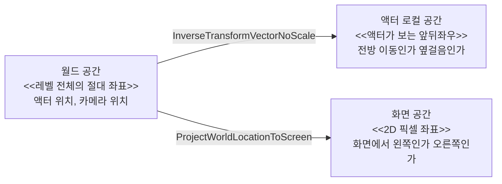
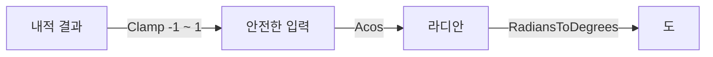
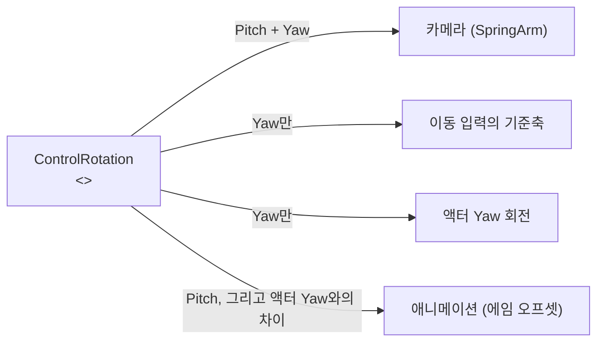

# 006 — 회전과 좌표 공간

- 기준 엔진: UE 5.8

---

## 1. 좌표 공간은 세 개를 쓴다

같은 위치·방향이라도 어느 기준에서 말하느냐에 따라 숫자가 완전히 달라진다.



언리얼의 축 규약: **+X 전방, +Y 오른쪽, +Z 위.**

### 월드 → 로컬: "얼마나 빠른가"가 아니라 "어느 쪽으로 가는가"

```
월드 속도 (300, 0, 0)  ← 이것만으로는 전진인지 후진인지 알 수 없다
        │  액터가 어디를 보고 있는지에 따라 의미가 달라진다
        ▼
액터 로컬 속도 (0, 300, 0)  ← 오른쪽으로 옆걸음 중
```

로코모션 블렌드스페이스가 필요한 값이 바로 이 로컬 속도다.
월드 속도를 액터 트랜스폼의 역변환으로 바꾸고 최대 속도로 나눠 `[-1, 1]`로 정규화한다.

## 2. 각도를 뺄 때는 그냥 빼면 안 된다

```
액터 Yaw = 350°,  컨트롤 Yaw = 10°

그냥 빼면:   10 - 350 = -340°   ← 340도 왼쪽으로 돈 것처럼 보인다
실제 차이:            +20°      ← 오른쪽으로 20도
```

- 각도는 360도에서 한 바퀴 돌아 0으로 되돌아오기 때문에, 단순 뺄셈은 경계에서 틀린다.
- `FMath::FindDeltaAngleDegrees(A, B)`는 `[-180, 180]` 범위의 **최단 회전량**을 준다.
- `FRotator::GetNormalized()`도 같은 이유로 쓴다. 누적된 회전값을 `[-180, 180]`으로 접는다.

## 3. 방향과 각도: 내적으로 "얼마나 정면인가"를 잰다

```
             후보 B
               ●
              /
       각도 θ /
카메라 ●-----→----------  카메라 전방 벡터
              \
               ●
             후보 A

   내적(전방, 후보방향) = cos θ
   → θ = acos(내적)
   → θ 가 임계각 이내인 후보만 남긴다
```

1. `(대상 위치 - 기준 위치).GetSafeNormal()` — 방향 벡터를 만든다. **정규화를 빠뜨리면 내적이 거리의 영향을 받는다.**
2. `FVector::DotProduct(전방, 방향)` — 두 단위벡터의 내적은 `cos θ`다.
3. `FMath::Acos(내적)` → 라디안 → `FMath::RadiansToDegrees`로 도 단위.



**`Clamp(-1, 1)`이 꼭 필요하다.** 부동소수점 오차로 내적이 `1.0000001`이 되면 `Acos`는 `NaN`을 돌려준다.

- 각도만으로는 벽 뒤의 대상도 통과한다. 그래서 카메라에서 대상까지 라인 트레이스로 가림을 함께 본다.

## 4. 시점 하나가 네 갈래로 갈라진다

컨트롤러가 들고 있는 회전값은 `ControlRotation` **하나**다. 그런데 그 값을 쓰는 쪽은 넷이고,
**각자 필요한 성분만 가져간다.**



| 쓰는 쪽 | 가져가는 성분 | 왜 그 성분만 필요한가 |
|---|---|---|
| 카메라(SpringArm) | Pitch + Yaw | 위아래로 내려다보고 올려다보려면 Pitch가 있어야 한다 |
| 이동 입력의 기준축 | Yaw만 | 지면 이동은 수평면 위의 문제다 |
| 액터 Yaw 회전 (캡슐 + 메시 전체) | Yaw만 | 위를 본다고 캐릭터가 뒤로 넘어가면 안 된다 |
| 애니메이션(에임 오프셋) | Pitch + 액터 Yaw와의 차이 | 액터는 그대로 두고 척추 본만 기울여 시선을 표현한다 |

**Pitch를 버리는 게 아니라, 이동과 액터 Yaw 회전에서만 잘라낸다.** 잘라낸 Pitch는 카메라와 애니메이션이
가져간다. 그래서 위를 올려다봐도 캐릭터는 수평으로 선 채 상체만 젖혀진다.

**액터 Yaw 회전과 에임 오프셋은 층이 다르다.** 앞은 캡슐과 메시가 통째로 도는 게임플레이 층이라
이동 방향과 판정 방향이 함께 따라오고, 뒤는 척추 본만 기울이는 표현 층이라 콜리전은 그대로다.

이 설정은 세 곳에 흩어져 있다 — 캐릭터 생성자의 `bUseControllerRotationPitch/Yaw/Roll`,
SpringArm의 `bUsePawnControlRotation`, AnimInstance의 각도 계산. **파일 하나만 봐서는 전체 그림이
보이지 않는다.**

### 이동 기준축에서 Pitch를 자르는 이유

```
      카메라가 30도 아래를 보는 상황 (옆에서 본 그림)

  카메라 ●
          \  ← ControlRotation 그대로의 전방 벡터
           \
   ─────────▼──────────────  지면
            전진 입력이 땅속을 향한다

  Yaw만 남기면:
  카메라 ●───────────────→   지면과 평행한 전방
```

- Yaw는 **월드 Z축(위쪽 축) 기준 회전**이라, Yaw만 남긴 회전에서 뽑은 축 벡터는 항상 수평면 위에 있다.
- 그래서 이동 입력은 `FRotator(0, Yaw, 0)`으로 기준축을 만든 뒤 전방·우측 벡터를 뽑아 쓴다.

### 액터 Yaw 회전은 규칙 하나만 켠다

액터 Yaw를 돌리는 규칙이 둘이고, **같이 켜면 서로 다른 방향으로 밀어 캐릭터가 떨린다.**

| 규칙 | 켜면 | 쓰는 상황 |
|---|---|---|
| `bUseControllerRotationYaw` | 시점 방향을 그대로 바라본다 | 특정 대상·방향을 계속 향해야 할 때 |
| `bOrientRotationToMovement` | 가는 쪽을 바라본다 | 자유 이동 |

- 회전이 즉시 일어나면 부자연스럽다. `RotationRate`가 초당 회전 속도를 정한다.
- 이 프로젝트에서는 락온 상태에 따라 둘을 맞바꾼다. 락온 중에는 대상을 바라본 채 옆걸음이 된다.

### 남은 Pitch의 행선지

- **카메라**: SpringArm이 `bUsePawnControlRotation = true`로 Pitch까지 따라간다.
  카메라 컴포넌트 자체는 이 값을 꺼 둔다. 붐이 이미 회전했는데 카메라가 또 회전하면 이중 적용이 된다.
- **애니메이션**: 에임 오프셋의 상하축이 Pitch, 좌우축이 액터 Yaw와 시점 Yaw의 차이다.
  그 차이를 단순 뺄셈으로 구하면 안 되는 이유는 [각도를 뺄 때는 그냥 빼면 안 된다](#2-각도를-뺄-때는-그냥-빼면-안-된다)에 있다.
- Pitch가 무한정 돌지 않는 것은 `PlayerCameraManager`의 시야각 제한 때문이다. 캐릭터 설정이 아니다.
- Roll은 어디서도 쓰지 않는다. 시점 조작으로 화면이 기울 이유가 없다.

### 증상에서 원인 찾기

이 구조를 알면 증상만으로 어느 갈래가 잘못됐는지 좁힐 수 있다.

| 증상 | 의심할 곳 |
|---|---|
| 카메라를 내려다본 채 전진하면 느리거나 이상한 쪽으로 간다 | 이동 기준축에 Pitch가 섞였다 |
| 캐릭터가 앞뒤로 기운다 | 액터가 Pitch를 가져갔다 (`bUseControllerRotationPitch`) |
| 위를 봐도 상체가 따라오지 않는다 | 애니메이션으로 Pitch가 전달되지 않는다 |
| 캐릭터가 제자리에서 떨린다 | 액터 Yaw 회전 규칙 두 개가 동시에 켜졌다 |
| 화면이 기울어진다 | Roll이 어딘가로 흘러 들어갔다 |

## 5. 화면 공간: 좌우를 판단하는 기준

"대상이 내 왼쪽인가 오른쪽인가"는 월드 좌표로 따지면 카메라 방향에 따라 답이 달라진다.
플레이어가 실제로 느끼는 좌우는 **화면에서의 좌우**다.

```
화면 (2D 픽셀)
┌───────────────────────────────────┐
│      ●B          ●현재 타겟   ●C   │
│     x=300         x=640     x=980 │
└───────────────────────────────────┘
        ← 왼쪽 전환          오른쪽 전환 →

ProjectWorldLocationToScreen 으로 각 후보의 x를 구하고,
현재 타겟의 x와 비교해 같은 방향 후보 중 가장 가까운 것을 고른다.
```

- 3D 위치를 2D로 투영하는 것이라 **화면 밖 대상은 투영이 실패할 수 있다.** 반환값을 반드시 확인한다.

## 6. 현재 코드에서 쓰고 있는 것

> 아직 만들지 않은 기능에 대한 예상은 적지 않는다. 구현한 뒤에 추가한다.

| 하는 일 | 쓰는 함수 | 어디에서 |
|---|---|---|
| 월드 속도 → 액터 로컬 속도 | `GetActorTransform().InverseTransformVectorNoScale` | [AnimInstance](../../Source/Blademaster/Animation/BlademasterAnimInstance.cpp) — 로코모션 축 값 |
| 액터 Yaw와 컨트롤 Yaw의 차이 | `FMath::FindDeltaAngleDegrees` | 〃 — 에임 오프셋 가로축 |
| 이동 입력을 카메라 기준으로 | `FRotationMatrix(YawRotation).GetUnitAxis` | [PlayerCharacter](../../Source/Blademaster/Characters/BlademasterPlayerCharacter.cpp) — `Move` |
| 대상 방향으로 시점 보간 | `.Rotation()` + `FMath::RInterpTo` + `SetControlRotation` | 〃 — 락온 중 `Tick` |
| 화면 중앙에 가까운 후보 고르기 | `DotProduct` → `Clamp` → `Acos` → `RadiansToDegrees` | [TargetingComponent](../../Source/Blademaster/Combat/BlademasterTargetingComponent.cpp) — `PassesAngleAndOcclusion` |
| 가림 판정 | `LineTraceSingleByChannel` | 〃 |
| 좌우 전환 대상 고르기 | `ProjectWorldLocationToScreen` | 〃 — `GetScreenSpaceX` |

`InverseTransformVectorNoScale`을 쓴 이유: 방향·속도 벡터는 스케일의 영향을 받으면 안 된다.
액터에 스케일이 걸려 있으면 일반 변환은 벡터 길이를 바꿔 버린다.

## 7. 자주 하는 실수

1. **정규화를 빠뜨린다.** 내적이 각도가 아니라 거리에 좌우된다.
2. **`Acos` 전에 클램프하지 않는다.** 부동소수점 오차 하나로 `NaN`이 나오고, 그 뒤 계산이 전부 오염된다.
3. **각도를 그냥 뺀다.** 0도와 360도 경계에서만 틀려서 발견이 늦다.
4. **도와 라디안을 섞는다.** 엔진 함수는 대부분 도(degree)를 쓰지만 `Acos`·`Atan2`는 라디안을 돌려준다.
5. **회전 규칙을 두 개 동시에 켠다.** 캐릭터가 떨리거나 엉뚱한 쪽을 본다.
6. **투영 실패를 확인하지 않는다.** 화면 밖 대상의 좌표를 그대로 쓰면 엉뚱한 대상이 선택된다.
