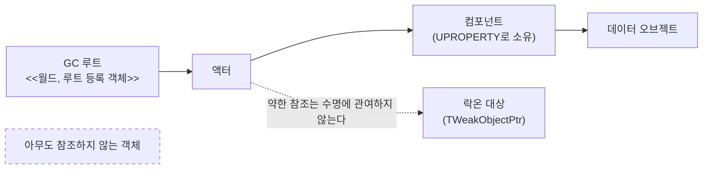
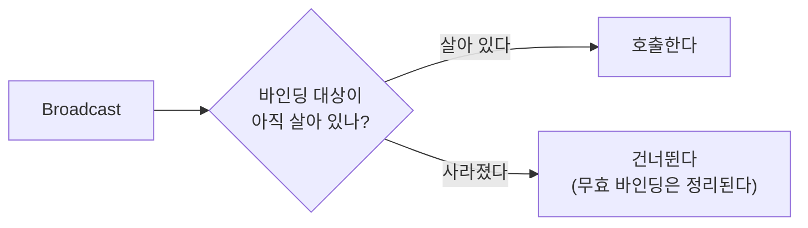
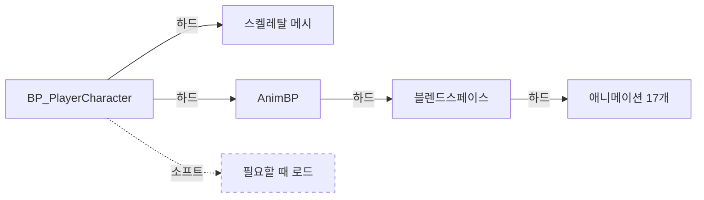

# 007 — 객체 수명과 참조

- 기준 엔진: UE 5.8

---

## 1. "참조"라는 말은 두 층에서 다른 일을 한다

| | 런타임 수명 | 에셋 의존성 |
|---|---|---|
| 묻는 것 | 이 객체가 지금 살아 있나? | 이걸 로드하면 뭐가 같이 딸려오나? |
| 담당 | 가비지 컬렉터 | 에셋 로더 · 패키징 |
| 단위 | 메모리 위의 `UObject` | 디스크 위의 에셋 파일 |
| 증상 | 파괴된 대상을 가리키고 있다 | 캐릭터 하나 여는데 관련 없어 보이는 에셋이 줄줄이 로드된다 |
| 이 노트에서 | 2절 | 3절 |

---

# 2. 런타임 수명

## 2.1 GC는 "루트에서 닿는가"로 판단한다



- 루트에서 강한 참조를 따라 **닿을 수 있으면 산다.** 닿지 못하면 회수된다.
- 이 방식을 **마크 앤 스윕**이라 하고, 공식 문서와 엔진 소스는 그 과정을 **도달성 분석(reachability
  analysis)**이라 부른다. 검색할 때는 후자가 더 정확히 걸린다.
- **순환 참조도 함께 회수된다.** 참조 카운트 방식이라면 A와 B가 서로를 가리킬 때 양쪽 카운트가
  0이 되지 않아 영영 남지만, 마크 앤 스윕은 "몇 명이 가리키는가"가 아니라 "루트에서 닿는가"를 본다.
  둘 다 루트에서 닿지 않으면 같이 사라진다.
- **연쇄는 전이된다.** A가 B를, B가 C를 강하게 참조하면 A가 사는 동안 C도 산다.
  의도치 않게 무거운 객체를 붙잡고 있는 경우가 여기서 생긴다.

## 2.2 `UPROPERTY`는 문법 관습이 아니라 수명 선언이다

```cpp
UPROPERTY(VisibleAnywhere, ...)
TObjectPtr<UAbilitySystemComponent> AbilitySystemComponent;   // GC가 추적한다
```

- `UPROPERTY` 없이 든 포인터는 **GC가 보지 못한다.** 대상이 회수돼도 포인터는 그대로 남아 댕글링이 된다.
- 반대로 필요 없어진 뒤에도 강하게 들고 있으면 회수되지 않는다. 수명을 늘리는 것도 이 선언이다.

## 2.3 약한 참조는 조용히 무효가 된다

```
프레임 N     CurrentTarget → [적 액터]        정상
적 사망 · Destroy
프레임 N+1   CurrentTarget → (무효)           알림 없음. 아무도 알려주지 않는다
```

- `TWeakObjectPtr`는 대상의 수명을 붙잡지 않는다. 대상이 사라지면 **조용히** 무효가 된다.
- `Destroy()`는 즉시 메모리를 반환하는 것이 아니라 **"이 객체는 쓰레기다"라고 표시하는 것**이다.
  게임플레이상으로는 월드에서 바로 빠지지만, 메모리는 다음 GC 때 정리된다.
  약한 참조는 그 표시를 보기 때문에 **다음 프레임에 이미 무효로 보인다.** 살아 있는 대상인지
  확인하는 용도로는 이게 맞는 동작이다.
- 이벤트가 오지 않으므로, 알아차리려면 **직접 확인해야 한다.** 락온 중에만 틱을 켜고 매 프레임 확인하는
  구조가 여기서 나왔다. 폴링이 마음에 안 들어서가 아니라, 알림이 존재하지 않기 때문이다.

## 2.4 세 가지 "없음"을 구분한다

같은 `nullptr`처럼 보여도 원인이 다르다.

| 상태 | `Get() == nullptr` | `IsStale()` | `IsExplicitlyNull()` |
|---|---|---|---|
| 한 번도 설정된 적 없음 / 명시적으로 null 대입 | 참 | 거짓 | **참** |
| 설정했는데 대상이 파괴됨 | 참 | **참** | 거짓 |

- `Get()`만 보면 **"애초에 없었다"와 "있었는데 사라졌다"를 구분할 수 없다.**
- 이 구분이 필요한 이유: 락온 해제(명시적 null)와 대상 소멸(무효화)은 같은 처리를 하면 안 된다.
  "바뀐 게 없으니 무시"를 `Get() == nullptr`로 판단하면, 대상이 파괴된 상황을 "원래 없었음"으로 오해해
  해제 알림을 보내지 않게 된다.

## 2.5 델리게이트에 바인딩한 객체가 죽으면

`AddUObject`로 바인딩하면 델리게이트는 **약한 참조**를 들고 있다
(`DelegateInstancesImpl.h`의 `TWeakObjectPtr<UserClass> UserObjectPtr`).



- 그래서 **바인딩한 객체가 죽어도 크래시하지 않는다.** `ExecuteIfSafe`가 유효성을 확인하고,
  무효해진 바인딩은 정리 대상이 된다.
- 델리게이트가 대상을 살려 두지도 **않는다.** 약한 참조라 GC를 막지 않는다.
- **주의: 이 보호는 `UObject` 바인딩에만 해당한다.** 일반 C++ 객체를 `AddRaw`로 바인딩하면
  이런 검사가 없어 댕글링이 된다.
- 자동 정리를 믿어도 되는 것과 별개로, 같은 대상을 여러 번 바인딩하면 여러 번 호출된다.
  바인딩 위치는 "액터당 한 번"이 보장되는 곳이어야 한다.

## 2.6 런타임에서 자주 하는 실수

1. **`UPROPERTY` 없이 `UObject` 포인터를 멤버로 든다.** GC가 회수해도 포인터는 남아 댕글링이 된다.
2. **약한 참조를 확인 없이 쓴다.** `Get()`의 결과를 검사하지 않으면 파괴된 순간에만 터진다.
3. **해제와 소멸을 같은 코드로 처리한다.** [세 가지 "없음"](#24-세-가지-없음을-구분한다)의 구분이 없으면
   한쪽 경로에서 알림이 빠진다.
4. **필요 없어진 참조를 계속 들고 있는다.** 회수되지 않아 메모리에 남는다. 원인을 찾기 어렵다.

---

# 3. 에셋 의존성

## 3.1 하드 참조는 전이된다



- **하드 참조는 소유자를 로드할 때 대상도 함께 로드한다.** 그 대상이 또 하드 참조를 갖고 있으면
  연쇄적으로 딸려온다. 위 그림에서 캐릭터 BP 하나를 로드하면 애니메이션까지 전부 올라온다.

## 3.2 클래스를 가리키는 참조도 하드 참조다

- **`TSubclassOf`는 클래스에 대한 하드 참조**다. 인스턴스가 아니라 클래스를 가리킬 뿐, 강도는 같다.
- 클래스가 로드되면 그 [CDO](002-class-default-object.md)도 함께 만들어지고,
  CDO가 참조하는 에셋도 따라 들어온다.

## 3.3 블루프린트의 `Cast To`도 하드 참조를 만든다

- 그래프에 `Cast To BP_X` 노드를 하나 놓으면 그 블루프린트가 `BP_X`를 붙잡는다.
- 무심코 넣은 캐스팅이 관련 없어 보이는 에셋들을 서로 묶는다. **코드에는 아무 흔적이 없어서**
  나중에 원인을 찾기 어렵다.

## 3.4 소프트 참조는 연쇄를 끊는다

- `TSoftObjectPtr` / `TSoftClassPtr`는 경로만 들고 있다가 **필요할 때 로드한다.**
- 소유자가 로드돼도 대상은 로드되지 않는다.
- 이 프로젝트에서는 아직 쓰지 않았다.

## 3.5 확인 방법

- 에디터에서 에셋 우클릭 → **Reference Viewer**로 연쇄를 그림으로 본다.
- **Size Map**으로 무엇이 용량을 차지하는지 본다.
- 원리만 알고 확인 방법을 모르면 실제 상황에서 못 쓴다.

---

# 4. 참고 자료

## 4.1 엔진 소스 (UE 5.8)

| 파일 | 내용 |
|---|---|
| `Engine/Source/Runtime/Core/Public/Delegates/DelegateInstancesImpl.h` | `UObject` 바인딩이 `TWeakObjectPtr`를 들고, `ExecuteIfSafe`로 유효성을 확인한다 |
| `Engine/Source/Runtime/Core/Public/Delegates/MulticastDelegateBase.h` | `Broadcast`에서 무효 바인딩을 건너뛰고 정리(`IsCompactable`)한다 |

## 4.2 공식 문서

| 문서 | 내용 |
|---|---|
| [Unreal Object Handling](https://dev.epicgames.com/documentation/en-us/unreal-engine/unreal-object-handling-in-unreal-engine) | GC가 마크 앤 스윕 방식이라는 것, 루트 셋에서 시작하는 도달성 분석, `UPROPERTY` 없는 날포인터가 추적되지 않는 이유 |
| [Garbage Collector Internals](https://dev.epicgames.com/community/learning/knowledge-base/ePKR/unreal-engine-garbage-collector-internals) | GC 내부 동작 심화 |
| [Incremental Garbage Collection](https://dev.epicgames.com/documentation/unreal-engine/incremental-garbage-collection-in-unreal-engine) | 도달성 분석이 한 프레임을 멈추는 이유와, 그것을 여러 프레임에 나누는 기능 |
