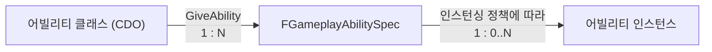
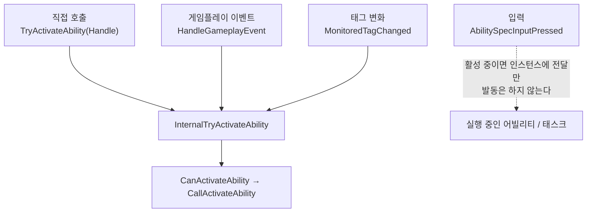
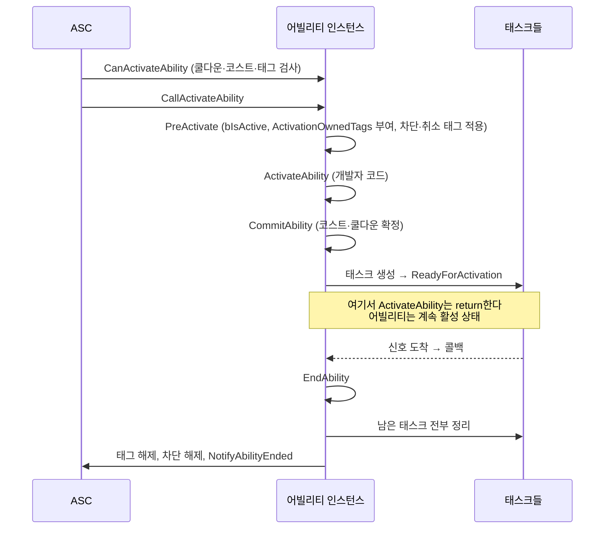
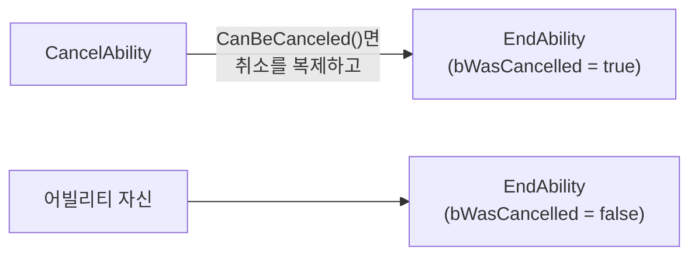

# 008 — 어빌리티 수명주기와 어빌리티 태스크

- 기준 엔진: UE 5.8

---

## 1. 한 문장 요약

어빌리티는 **부여(Give) → 발동(Activate) → 종료(End)** 를 거치는 객체이고,
발동과 종료 사이에서 "시간이 걸리는 기다림"은 **어빌리티 태스크**가 맡는다.

`ActivateAbility`는 함수 한 번 호출로 끝나지만 어빌리티는 끝나지 않는다.
어빌리티는 **누군가 `EndAbility`를 부를 때까지** 활성 상태로 남아 있고,
그동안 태스크들이 몽타주 종료·입력·태그 같은 신호를 기다렸다가 콜백을 부른다.

## 2. 부여: 클래스 → Spec → 인스턴스

어빌리티는 세 층으로 나뉜다. **CDO는 정의, Spec은 소유, 인스턴스는 실행**이다.



화살표의 숫자는 개수 관계다. CDO 하나가 여러 ASC에 부여되어 Spec이 여럿 생기고,
Spec 하나에 인스턴스는 0개일 수도 여러 개일 수도 있다.

### 세 층의 책임

| 층 | 답하는 질문 | 담는 것 | 이 프로젝트의 예 |
|---|---|---|---|
| **클래스 (CDO)** | 이 어빌리티는 **어떤 것**인가 | 설정. 모든 소유자가 공유, 읽기 전용 | `GA_SwordAndShield_Combo`의 `ComboDefinition`, 인스턴싱·네트워크 정책 |
| **Spec** | **누가, 어떤 조건으로** 가지고 있나 | 부여 기록 | 플레이어 ASC의 콤보 한 칸 — 핸들, 레벨 1, 입력 태그 `InputTag.Attack`, 실행 중인 개수 |
| **인스턴스** | **지금 실행 중인 한 번**의 상태는 | 실행 상태 | `CurrentAttackIndex`, `bInputBuffered`, `CurrentMontageTask` |

더미와 플레이어는 `GA_Hit`의 **CDO를 공유**하지만, **Spec은 각자의 ASC에 하나씩** 있고 **인스턴스도 각자** 가진다.

GE도 같은 모양의 3단 구조다([004 §3](004-gas-overview.md#3-클래스--spec--activegameplayeffect)). 다만 GE의 Spec은 "이번 적용분"이고,
어빌리티의 Spec은 "이 ASC가 가지고 있는 한 칸"이라 의미가 다르다.

**Spec이 담는 것** (`GameplayAbilitySpec.h`)

- `Handle` — Spec을 가리키는 식별자. 어빌리티 함수들이 `FGameplayAbilitySpecHandle`을 인자로 주고받는 이유다
- `Ability` — 어빌리티 클래스의 CDO
- `Level`, `SourceObject` — 소유자마다 다를 수 있는 값
- `DynamicSpecSourceTags` — 부여할 때 붙이는 태그. 이 프로젝트는 여기에 **입력 태그**를 넣는다
- `ActiveCount` — 지금 몇 개가 실행 중인가. `IsActive()`는 이 값이 0보다 큰지 본다
- `InputPressed` — 입력이 눌려 있는가
- `ReplicatedInstances` / `NonReplicatedInstances` — 이 Spec에서 만들어진 인스턴스 목록 (`:256-262`)

### 왜 Spec과 인스턴스를 나눴나

두 층은 **개수, 수명, 네트워크 전달 방식**이 모두 다르다.

**① 개수가 다르다 — Spec 1개에 인스턴스 0..N개**

| 정책 | 인스턴스 개수 |
|---|---|
| `InstancedPerActor` | 1개 |
| `InstancedPerExecution` | 실행 중이 아니면 0개, 동시에 실행되면 여러 개 |
| ~~`NonInstanced`~~ | 항상 0개 |

"가지고 있다"는 사실은 실행하지 않을 때도 하나로 존재해야 한다. 그래서 인스턴스에 부여 기록을 담을 수 없다.

**② 수명이 다르다**

- Spec은 부여된 순간부터 제거될 때까지 남는다.
- `InstancedPerExecution`의 인스턴스는 발동할 때 만들어지고, 끝나면 목록에서 빠져 가비지로 처리된다
  (`AbilitySystemComponent_Abilities.cpp:1265-1283`).

실행할 때만 필요한 객체를 오래 사는 기록과 분리해야, 필요할 때 만들고 버릴 수 있다.

**③ 네트워크 전달 방식이 다르다**

- **Spec은 작은 구조체**이고, `ActivatableAbilities`에 담겨 **소유 클라이언트에게 복제**된다
  (`COND_ReplayOrOwner`, `AbilitySystemComponent.cpp:1861-1862`).
  클라이언트는 이것으로 "내가 이 어빌리티를 가졌고 입력 태그가 무엇인지" 알고, 입력이 오면 스스로 발동(예측)할 수 있다.
  남의 캐릭터가 어떤 어빌리티를 가졌는지는 다른 클라이언트가 알 필요가 없다.
- **인스턴스는 UObject**이고, 복제 정책 `ReplicationPolicy`의 기본값이 `ReplicateNo`라 **기계마다 각자 만든다**
  (`GameplayAbility.h:689-691`, `AbilitySystemComponent_Abilities.cpp:1211-1220`).
  클라이언트에 Spec이 도착하면 그 기계의 `OnGiveAbility`가 인스턴스를 만든다 (`GameplayAbilityTypes.cpp:277`).

실행 상태를 매번 네트워크로 보내지 않고, **부여 기록만 보내고 실행은 각자 한다.**

### CDO와 Spec은 왜 나눴나

레벨, 입력 태그, 부여 출처(`SourceObject`)는 **소유자마다 다른 값**인데, CDO는 모두가 공유하는 읽기 전용 객체라 담을 수 없다.
또 `GiveAbility`는 중복을 막지 않고 목록에 추가만 한다 (`AbilitySystemComponent_Abilities.cpp:317`).
그래서 같은 클래스를 다른 조건으로 두 번 부여할 수 있고, 두 부여는 **핸들**로 구분된다.

### 부여는 서버에서만 한다

`GiveAbility`는 권한이 없으면 에러 로그를 남기고 무효 핸들을 돌려준다 (`AbilitySystemComponent_Abilities.cpp:301-306`).
Spec은 서버가 만들어 복제하는 기록이기 때문이다. 클라이언트는 ③처럼 받은 Spec으로 자기 인스턴스를 만든다.

## 3. 인스턴싱 정책: 어빌리티의 상태를 어디에 둘 수 있나

어빌리티에 멤버 변수(몇 타째인지, 선입력이 있었는지)를 둘 수 있는지는 인스턴싱 정책이 정한다
(`GameplayAbilityTypes.h:35-56`).

| 정책 | 인스턴스 | 동시 실행 | 발동 사이에 상태가 남는가 |
|---|---|---|---|
| `InstancedPerActor` | 액터당 하나. **부여할 때** 만든다 | 한 번에 하나 | **남는다** |
| `InstancedPerExecution` | **발동할 때마다** 새로 만든다 | 여러 개 가능 | 남지 않는다 |
| ~~`NonInstanced`~~ | 없음. CDO에서 실행 | — | 상태를 가질 수 없다 |

- **엔진 기본값은 `InstancedPerExecution`이다** (`GameplayAbility.cpp:102`). 이 프로젝트는 세 어빌리티 모두 생성자에서 `InstancedPerActor`로 바꾼다.
- `NonInstanced`는 5.5에서 deprecated 되었다. 엔진 주석은 "헷갈리는 경계 상황을 피하려면 `InstancedPerActor`를 기본으로 쓰라"고 한다.
- `InstancedPerActor`의 인스턴스는 `GiveAbility` 시점에 만들어진다 (`AbilitySystemComponent_Abilities.cpp:319-323`).
  `InstancedPerExecution`은 발동 시점에 만든다 (같은 파일 `:1915-1918`).

**`InstancedPerActor`에서 주의할 점: 같은 객체가 계속 재사용된다.**
이전 발동에서 바꾼 멤버 값이 다음 발동 때 그대로 남아 있다.
그래서 멤버 상태는 `ActivateAbility` 시작 시점에 직접 초기화해야 한다.

**재발동 — `bRetriggerInstancedAbility`**

`InstancedPerActor` 어빌리티는 이미 실행 중이면 다시 발동할 수 없다. 이 플래그를 켜면 동작이 바뀐다
(`AbilitySystemComponent_Abilities.cpp:1833-1851`).

| 플래그 | 실행 중에 또 발동하면 |
|---|---|
| 꺼짐 (기본) | 발동 실패 |
| 켜짐 | 실행 중인 인스턴스를 `EndAbility`(취소 아님, `bWasCancelled = false`)로 끝내고 **같은 인스턴스로** 다시 발동 |

"처음부터 다시"는 새 객체가 생기는 게 아니다. **같은 객체가 끝났다가 다시 시작하는 것**이라
`EndAbility`의 정리 코드와 `ActivateAbility`의 초기화 코드가 둘 다 제대로 있어야 한다.

## 4. 발동 경로 세 가지



**① 직접 호출 — `TryActivateAbility`**

가장 기본 경로. 어떤 경로로 오든 결국 `InternalTryActivateAbility`로 모인다.

**② 입력 — `AbilitySpecInputPressed` / `Released`**

- 이 함수는 **발동하지 않는다.** Spec의 `InputPressed`를 켜고, 이미 활성 중이면 인스턴스의 `InputPressed`를 부를 뿐이다 (`AbilitySystemComponent_Abilities.cpp:2914-2933`).
- 그래서 "누르면 발동"은 호출하는 쪽이 따로 해야 한다. 이 프로젝트는 `UBlademasterCombatComponent`가
  입력 태그로 Spec을 찾아 `AbilitySpecInputPressed`를 부르고, 활성 상태가 아니면 `TryActivateAbility`를 부른다.
- `UGameplayAbility::InputPressed`의 기본 구현은 비어 있다 (`GameplayAbility.h:373`).
  실행 중인 어빌리티가 `WaitInputPress` 태스크로 입력을 받으려면 추가 연결이 필요한데,
  그 이유는 예측과 관련 있어서 010에서 다룬다.

**③ 트리거 — `AbilityTriggers`**

어빌리티가 스스로 "이 신호가 오면 나를 발동하라"고 선언한다. 부여할 때 ASC에 등록된다
(`OnGiveAbility` → `RegisterAbilityTriggers`). 종류는 세 가지다 (`GameplayAbilityTriggerType.h:9-23`).

| TriggerSource | 발동 조건 | 태그가 사라지면 | 이벤트 데이터 |
|---|---|---|---|
| `GameplayEvent` | `SendGameplayEventToActor` 등으로 이벤트가 오면 | — | 보낸 쪽이 채운 `FGameplayEventData` |
| `OwnedTagAdded` | 소유자에게 태그가 **붙는 순간** | 그대로 실행 | 엔진이 채움 (Instigator = 자기 자신) |
| `OwnedTagPresent` | 소유자에게 태그가 붙는 순간 | **취소된다** | 〃 |

- **게임플레이 이벤트는 부모 태그로도 전달된다.** `HandleGameplayEvent`는 이벤트 태그에서 부모로 올라가며
  등록된 어빌리티를 찾는다 (`AbilitySystemComponent_Abilities.cpp:2569-2584`).
  `GameplayEvent.WeaponHit` 이벤트는 `GameplayEvent`를 듣는 어빌리티도 깨운다.
- **태그 트리거는 태그 개수가 0↔1로 바뀔 때만 반응한다.** 등록에 쓰는 `RegisterGameplayTagEvent`의 기본 이벤트 종류가
  "새로 생김 / 완전히 사라짐"이라서, 이미 붙어 있는 태그의 개수가 늘어나는 건 신호가 아니다 (`:613`, `:2646-2690`).
- **트리거 발동에도 네트워크 권한 검사가 있다.** `ServerOnly`·`ServerInitiated`는 서버에서만,
  `LocalPredicted`·`LocalOnly`는 로컬 컨트롤러에서만 태그 트리거로 발동한다 (`:2699-2715`).

## 5. 한 번 실행되는 흐름



| 단계 | 누가 부르나 | 하는 일 | 위치 |
|---|---|---|---|
| `CanActivateAbility` | 엔진 | 입력 억제, 쿨다운, 코스트, 태그 요구 조건, 입력 차단 검사 | `GameplayAbility.cpp:457` |
| `PreActivate` | 엔진 | `bIsActive = true`, 현재 정보 저장, `ActivationOwnedTags` 부여, `BlockAbilitiesWithTag`·`CancelAbilitiesWithTag` 적용, `ActiveCount` 증가 | `:940` |
| `ActivateAbility` | 엔진 → **개발자 코드** | 어빌리티의 실제 내용 | `:904` |
| `CommitAbility` | **개발자 코드** | 코스트·쿨다운을 한 번 더 검사하고 실제로 적용 | `:592` |
| `EndAbility` | **개발자 코드** 또는 엔진 | 정리 (§6) | `:802` |

- `CanActivateAbility`는 인스턴스가 있으면 인스턴스에서, 없으면 CDO에서 불린다 (`AbilitySystemComponent_Abilities.cpp:1817`).
- `CallActivateAbility`는 `PreActivate`와 `ActivateAbility`를 차례로 부르는 게 전부다 (`GameplayAbility.cpp:1020-1024`).

**커밋을 발동과 나눈 이유**

`CanActivateAbility`에서 통과한 뒤 실제로 자원을 쓰기 전까지 상황이 바뀔 수 있다.
커밋은 "이제 정말 쓴다"는 마지막 확인 지점이다. 네이티브 `ActivateAbility`의 기본 구현 주석도
"`ActivateAbility`를 오버라이드하고 거기서 `CommitAbility`를 불러 결과를 확인하라"고 안내한다 (`:925-934`).
또 발동은 했지만 코스트는 나중에(예: 칼이 실제로 나가는 순간) 치르는 설계도 가능해진다.

## 6. 종료와 취소



| | `EndAbility` | `CancelAbility` |
|---|---|---|
| 의미 | "끝났다" | "밖에서 중단시켰다" |
| 누가 부르나 | 보통 어빌리티 자신 | 다른 어빌리티, ASC(`CancelAbilities`), 트리거 태그 제거 |
| 조건 | 활성 상태이고 이미 끝나는 중이 아닐 때 | `CanBeCanceled()`일 때만 |
| 실제 동작 | 정리 수행 | 복제한 뒤 `EndAbility(..., bWasCancelled = true)` 호출 (`GameplayAbility.cpp:741-769`) |

**`EndAbility`가 정리하는 것** (`GameplayAbility.cpp:802-900`)

1. 이미 끝났거나 끝나는 중이면 무시한다 (`IsEndAbilityValid`, 중복 호출 방지)
2. `OnGameplayAbilityEnded` 델리게이트 방송 후 비움
3. `bIsActive = false`
4. **남아 있는 태스크 전부에 `TaskOwnerEnded`를 보낸다** — 태스크들이 스스로 정리된다
5. `bReplicateEndAbility`면 종료를 상대 기계에 알린다
6. `ActivationOwnedTags` 제거, 차단·취소 태그 해제
7. ASC에 `NotifyAbilityEnded` — `ActiveCount` 감소

**끝나지 않은 어빌리티가 남기는 것**

`EndAbility`를 부르지 않으면 위 목록이 하나도 실행되지 않는다.

- `ActivationOwnedTags`가 계속 붙어 있다 → 그 태그를 보는 모든 시스템이 "아직 공격 중"이라고 판단한다
- 차단 태그가 풀리지 않는다 → 다른 어빌리티가 계속 막힌다
- `InstancedPerActor`라면 다시 발동할 수 없다
- 태스크가 남아 콜백이 계속 들어올 수 있다

그래서 **모든 경로가 결국 `EndAbility`에 도달하는지**가 어빌리티 코드 리뷰의 첫 번째 확인 항목이다.
발동 실패 분기, 태스크의 중단·취소 콜백까지 포함해서.

## 7. 어빌리티 태스크: 왜 필요한가

`ActivateAbility`는 평범한 C++ 함수라 **한 프레임 안에서 return해야 한다.**
하지만 공격은 "몽타주를 재생하고, 이어가기 구간을 기다리고, 입력이 오면 다음 타로"처럼 시간이 걸린다.

태스크는 **"무언가를 기다렸다가 델리게이트로 알려주는 객체"** 다.
기다리는 동안 어빌리티 코드는 이미 return해 있고, 신호가 오면 태스크가 어빌리티의 콜백을 부른다.

**사용 순서**

```cpp
// 1. 정적 팩토리로 생성 — 첫 인자는 소유 어빌리티
UAbilityTask_WaitDelay* Task = UAbilityTask_WaitDelay::WaitDelay(this, RespawnDelay);
// 2. 델리게이트 바인딩 — 동적 델리게이트라 콜백은 UFUNCTION이어야 한다
Task->OnFinish.AddDynamic(this, &UBlademasterGameplayAbility_Respawn::OnRespawnDelayFinished);
// 3. 활성화 — 이걸 부르지 않으면 태스크는 아무것도 하지 않는다
Task->ReadyForActivation();
```

바인딩을 먼저 하고 활성화를 나중에 하는 이유: **활성화하는 순간 바로 신호를 보낼 수 있는 태스크**가 있기 때문이다
(§8의 `WaitGameplayTagAdded`가 그렇다). 순서가 반대면 그 신호를 놓친다.

**태스크의 수명**

| 끝나는 방법 | 호출 | 결과 |
|---|---|---|
| 스스로 끝냄 / 코드에서 끝냄 | `EndTask()` | `OnDestroy(false)` (`GameplayTask.cpp:165`) |
| 소유 어빌리티가 끝남 | `TaskOwnerEnded()` | `OnDestroy(true)` (`GameplayTask.cpp:144`) |

- 어빌리티가 끝나면 태스크는 자동으로 정리된다. **반대로 어빌리티가 살아 있는 동안에는 태스크가 알아서 사라지지 않는다.**
  같은 종류의 태스크를 여러 번 만들면, 앞의 것을 `EndTask()`로 끝내지 않는 한 모두 살아서 신호에 반응한다.
- **어빌리티가 비활성이면 태스크는 델리게이트를 방송하지 않는다** (`ShouldBroadcastAbilityTaskDelegates`, `AbilityTask.cpp:197-207`).
  끝난 어빌리티의 콜백이 뒤늦게 불리는 것을 막아 준다.
- `OnDestroy`의 인자(`true`/`false`)로 "어빌리티가 끝나서 정리되는가, 태스크만 끝나는가"를 구분한다.
  몽타주 태스크는 이 구분을 사용한다 (§8).

## 8. M1에서 쓴 태스크 네 가지

| 태스크 | 기다리는 신호 | 한 번 발동 후 | 핵심 동작 |
|---|---|---|---|
| `PlayMontageAndWait` | 몽타주 블렌드 아웃 시작 / 종료 / 중단 | 종료되면 끝 | 아래 표 |
| `WaitInputPress` | 입력 눌림 (복제된 이벤트) | **항상 끝난다** | 계속 받으려면 다시 만들어야 한다 |
| `WaitGameplayTagAdded` | 태그가 붙음 | `OnlyTriggerOnce`면 끝 | **시작할 때 이미 태그가 있으면 즉시 발동** |
| `WaitDelay` | 타이머 | 끝 | 0 이하면 다음 틱에 발동 |

**`PlayMontageAndWait` — 델리게이트가 언제 오는가** (`AbilityTask_PlayMontageAndWait.cpp`)

| 델리게이트 | 언제 | 위치 |
|---|---|---|
| `OnBlendOut` | 중단 없이 **블렌드 아웃이 시작될 때** | `:18-56` |
| `OnCompleted` | 중단 없이 **블렌드 아웃까지 다 끝났을 때** | `:85-102` |
| `OnInterrupted` | 다른 몽타주 등에 의해 중단될 때, 어빌리티가 취소될 때 | `:45`, `:67-83` |
| `OnCancelled` | 몽타주 재생 자체에 실패했을 때, 외부 취소 | `:176-196` |

- `OnCompleted`는 블렌드 아웃이 **끝나야** 온다. 자동 블렌드 아웃을 끈 몽타주는 블렌드 아웃이 일어나지 않으므로 이 신호가 오지 않는다.
- **`EndTask()`는 몽타주를 멈추지 않는다.** 몽타주를 멈추는 건 `OnDestroy(true)`, 즉 **어빌리티가 끝날 때**이고
  그마저도 `bStopWhenAbilityEnds`가 켜져 있을 때만이다 (`:198-215`).
  태스크만 끝내면 몽타주는 계속 재생되고, 콜백만 끊긴다.
- `bStopWhenAbilityEnds = false`로 만들면 몽타주가 어빌리티보다 오래 산다. 그 몽타주를 내리는 책임은 다른 곳으로 넘어간다.

**`WaitInputPress`** (`AbilityTask_WaitInputPress.cpp`)

- 신호를 받으면 콜백을 부르고 **무조건 `EndTask()`** 한다 (`:16-46`). "누를 때마다"를 원하면 콜백에서 새 태스크를 만든다.
- 직접 입력 장치를 보는 게 아니라 ASC의 **복제 이벤트(`InputPressed`)** 를 기다린다 (`:72`).
  그래서 §4에서 말한 것처럼 입력이 이 이벤트로 이어져야 반응한다.
- `bTestAlreadyPressed`를 켜면 시작 시점에 이미 눌려 있는지도 확인한다 (`:62-69`).

**`WaitGameplayTagAdded`** (`AbilityTask_WaitGameplayTag.cpp:26-43`)

- `Activate`에서 먼저 "지금 태그가 있는가"를 확인하고, 있으면 **바로 방송**한다.
  즉 이 태스크는 "태그가 새로 붙는 순간"이 아니라 **"태그가 있는 상태가 되는 순간(이미 있으면 지금)"** 을 알려준다.
- 이름만 보고 "추가 이벤트만 듣는다"고 가정하면 틀린다.

## 9. 현재 코드에 적용된 것

세 어빌리티가 수명주기의 서로 다른 모양을 보여준다.

| | 콤보 | 피격 | 부활 |
|---|---|---|---|
| 클래스 | [`UBlademasterGameplayAbility_Combo`](../../Source/Blademaster/Combat/BlademasterGameplayAbility_Combo.cpp) | [`UBlademasterGameplayAbility_Hit`](../../Source/Blademaster/Combat/BlademasterGameplayAbility_Hit.cpp) | [`UBlademasterGameplayAbility_Respawn`](../../Source/Blademaster/Combat/BlademasterGameplayAbility_Respawn.cpp) |
| 발동 경로 | 입력 → `TryActivateAbility` | 트리거 `GameplayEvent` (`GameplayEvent.WeaponHit`) | 트리거 `OwnedTagAdded` (`State.Dead`) |
| 인스턴싱 | `InstancedPerActor` | `InstancedPerActor` + 재발동 | `InstancedPerActor` |
| 사용 태스크 | 몽타주, 입력, 태그 | 몽타주, 딜레이 | 딜레이 |
| 끝나는 곳 | 몽타주 완료·중단, 이어가기를 놓침 | 피격 몽타주 종료, 사망 몽타주 길이만큼 뒤 | 딜레이 후 부활 처리 |

**콤보 — 여러 타를 어빌리티 하나로**

- 한 번 발동하면 4타가 끝날 때까지 **같은 활성 상태**가 이어진다. 타마다 발동하지 않는다.
  그래서 `ActivationOwnedTags`의 `State.Attacking`이 콤보 전체 동안 붙어 있다.
- 타가 바뀔 때 몽타주 태스크와 입력 태스크를 **직접 `EndTask()`하고 새로 만든다.**
  어빌리티는 끝나지 않으므로 엔진의 자동 정리(§7)가 일어나지 않기 때문이다.
  현재 태스크를 멤버(`CurrentMontageTask`, `CurrentInputTask`)로 들고 있는 이유다.
- 타를 넘기려고 이전 몽타주를 끊으면 `OnInterrupted`가 올 수 있다. `bTransitioned`로 "의도한 중단"을 구분해 `EndAbility`를 부르지 않는다.
- 멤버 상태(`CurrentAttackIndex`, `bInputBuffered`, `bTransitioned`)는 `PlayAttack`에서 초기화한다.

**피격 — 이벤트로 발동, 맞을 때마다 재발동**

- `AbilityTriggers`에 `GameplayEvent.WeaponHit`을 등록해 두면, 판정 쪽은 이 어빌리티를 몰라도 이벤트만 보내면 된다.
  `TriggerEventData`로 공격자·HitResult·컨텍스트가 들어온다.
- `bRetriggerInstancedAbility = true` — 피격 중에 또 맞으면 같은 인스턴스가 끝났다가 다시 시작한다.
  그래서 `bBlockedActionAbilities`를 `ActivateAbility` 맨 앞에서 초기화하고, `EndAbility`에서 이 값을 보고 차단을 푼다.
- 사망 몽타주는 `bStopWhenAbilityEnds = false`로 재생한다. 어빌리티가 끝나도 쓰러진 자세가 유지되고,
  그 몽타주를 내리는 책임은 부활 어빌리티로 넘어간다.

**부활 — 태그로 발동, 부여 여부로 기능을 켜고 끈다**

- 피격 어빌리티는 `State.Dead`를 붙이기만 한다. 부활을 전혀 모른다.
- 부활 어빌리티를 **부여받은 캐릭터만** 그 태그에 반응한다. 더미에게만 부여하고 플레이어에게는 부여하지 않아서,
  "부활하는가"를 설정값 없이 **부여 여부**로 표현한다.
- `OwnedTagAdded`라서 부활 대기 중에 태그가 사라져도 취소되지 않는다. `OwnedTagPresent`였다면 취소된다.

**부여와 입력 연결** — [`UBlademasterCombatComponent`](../../Source/Blademaster/Combat/BlademasterCombatComponent.cpp)

- `GrantStartingAbilities`는 `ABlademasterCharacter::BeginPlay`에서 **서버일 때만**, `InitAbilityActorInfo` 다음에 불린다.
- 부여할 때 Spec의 `DynamicSpecSourceTags`에 입력 태그를 넣고, 입력이 오면 그 태그로 Spec을 찾는다.

## 10. 자주 하는 실수

1. **`EndAbility`에 도달하지 않는 경로를 만든다.** 발동 실패 분기, 태스크의 `OnInterrupted`·`OnCancelled`를 빠뜨린다.
   → 태그와 차단이 영원히 남는다.
2. **`EndAbility`를 부른 뒤 return하지 않는다.** 이후 코드가 끝난 어빌리티의 상태로 계속 실행된다.
3. **`InstancedPerActor`의 멤버를 초기화하지 않는다.** 이전 발동의 값이 다음 발동에 섞인다.
4. **클라이언트에서 `GiveAbility`를 부른다.** 에러 로그만 남고 부여되지 않는다.
5. **`ReadyForActivation`을 빠뜨린다.** 태스크가 만들어졌지만 아무 일도 하지 않는다. 에러도 없다.
6. **델리게이트 바인딩보다 활성화를 먼저 한다.** 즉시 발동하는 태스크의 신호를 놓친다.
7. **태스크 콜백에 `UFUNCTION()`을 빠뜨린다.** 동적 델리게이트(`AddDynamic`)는 리플렉션으로 함수를 찾는다.
8. **한 번 발동하고 끝나는 태스크를 "계속 듣는다"고 가정한다.** 반대로, 다시 만들면서 이전 태스크를 끝내지 않는다.
9. **`EndTask()`가 몽타주를 멈춘다고 가정한다.**
10. **`AbilitySpecInputPressed`가 어빌리티를 발동한다고 가정한다.**
11. **`OwnedTagAdded`와 `OwnedTagPresent`를 혼동한다.** 태그가 사라질 때 취소되길 원하는지로 고른다.

## 11. 자가 점검 질문

코드를 보지 않고 답해 본다.

1. CDO, `FGameplayAbilitySpec`, 어빌리티 인스턴스는 각각 무엇을 책임지나? Spec과 인스턴스를 한 객체로 합칠 수 없는 이유 세 가지는?
2. 콤보 어빌리티에 "몇 타째"를 멤버 변수로 둘 수 있는 이유는? `InstancedPerExecution`이었다면 어떻게 되나?
3. `ActivateAbility`가 return했는데 어빌리티가 아직 활성인 상태란 무슨 뜻인가?
4. `PreActivate`에서 엔진이 대신 해주는 일 세 가지는?
5. `EndAbility`와 `CancelAbility`의 차이는? 피격 어빌리티가 공격 어빌리티를 끊을 때는 어느 쪽이 불리나?
6. `EndAbility`를 부르지 않으면 어떤 일들이 일어나나?
7. 어빌리티 태스크가 필요한 이유를 "한 프레임"이라는 말을 써서 설명하라.
8. 태스크를 만들 때 델리게이트 바인딩을 `ReadyForActivation`보다 먼저 하는 이유는?
9. 어빌리티가 끝나면 태스크는 어떻게 되나? 어빌리티가 끝나지 않고 타만 바뀔 때는?
10. `PlayMontageAndWait`의 `OnBlendOut`과 `OnCompleted`는 각각 언제 오나? `EndTask()`를 부르면 몽타주는 멈추나?
11. `bRetriggerInstancedAbility`를 켠 어빌리티가 재발동될 때 `EndAbility`와 `ActivateAbility`는 어떤 순서로 불리나? 인스턴스는 새로 만들어지나?
12. 부활을 "설정값 0이면 부활 안 함" 대신 "부여 여부"로 표현했을 때 장점은?

## 12. 엔진 소스 참고 (UE 5.8)

경로 앞부분 `Engine/Plugins/Runtime/GameplayAbilities/Source/GameplayAbilities/`는 `GA/`로 줄인다.

| 파일 | 위치 | 내용 |
|---|---|---|
| `GA/Public/Abilities/GameplayAbilityTypes.h` | 35-56 | `EGameplayAbilityInstancingPolicy`와 주석 |
| `GA/Public/Abilities/GameplayAbilityTriggerType.h` | 9-23 | `EGameplayAbilityTriggerSource` 세 종류 |
| `GA/Public/Abilities/GameplayAbility.h` | 263, 299, 336, 574-580, 604 | 수명주기 함수 선언 |
| 〃 | 373 | 비어 있는 `InputPressed` |
| 〃 | 703, 727, 747 | `bRetriggerInstancedAbility`, `AbilityTriggers`, `ActivationOwnedTags` |
| `GA/Public/GameplayAbilitySpec.h` | 199-249 | Spec 필드 (`Ability`, `Level`, `ActiveCount`, `InputPressed`, `DynamicSpecSourceTags`) |
| 〃 | 256-262 | Spec이 들고 있는 인스턴스 목록 |
| `GA/Public/Abilities/GameplayAbility.h` | 689-691 | `ReplicationPolicy` |
| `GA/Private/Abilities/GameplayAbility.cpp` | 102 | 기본 인스턴싱 정책 `InstancedPerExecution` |
| 〃 | 457 | `CanActivateAbility` |
| 〃 | 592 | `CommitAbility` |
| 〃 | 741-769 | `CancelAbility` → `EndAbility(bWasCancelled = true)` |
| 〃 | 802-900 | `EndAbility` 정리 순서 |
| 〃 | 904-934 | 기본 `ActivateAbility`와 커밋 안내 주석 |
| 〃 | 940-1010 | `PreActivate` |
| 〃 | 1020-1024 | `CallActivateAbility` |
| `GA/Private/AbilitySystemComponent_Abilities.cpp` | 292-331 | `GiveAbility` (권한 검사, 인스턴스 생성) |
| 〃 | 542-590 | `OnGiveAbility`, 트리거 등록 |
| 〃 | 1196-1223 | `CreateNewInstanceOfAbility` — 복제 정책에 따라 인스턴스 목록에 추가 |
| 〃 | 1225, 1265-1283 | `NotifyAbilityEnded` — `InstancedPerExecution` 인스턴스 정리 |
| 〃 | 1704-1920 | `InternalTryActivateAbility` (네트워크 정책 검사, 재발동, 인스턴스 생성) |
| 〃 | 2564-2600 | `HandleGameplayEvent` — 부모 태그로 전파 |
| 〃 | 2646-2715 | `MonitoredTagChanged`, 트리거 발동 권한 |
| 〃 | 2914-2933 | `AbilitySpecInputPressed` — 발동하지 않는다 |
| `GA/Private/AbilitySystemComponent.cpp` | 1861-1862 | `ActivatableAbilities` 복제 조건 `COND_ReplayOrOwner` |
| `GA/Private/GameplayAbilityTypes.cpp` | 277 | 클라이언트에 Spec 도착 시 `OnGiveAbility` |
| `GA/Private/Abilities/Tasks/AbilityTask.cpp` | 197-207 | `ShouldBroadcastAbilityTaskDelegates` |
| `GA/Private/Abilities/Tasks/AbilityTask_PlayMontageAndWait.cpp` | 18-102, 198-215 | 델리게이트 시점, `OnDestroy`와 `bStopWhenAbilityEnds` |
| `GA/Private/Abilities/Tasks/AbilityTask_WaitInputPress.cpp` | 16-46, 55-80 | 발동 후 `EndTask`, 복제 이벤트 대기 |
| `GA/Private/Abilities/Tasks/AbilityTask_WaitGameplayTag.cpp` | 26-43 | 시작 시 태그가 있으면 즉시 발동 |
| `GA/Private/Abilities/Tasks/AbilityTask_WaitDelay.cpp` | 26-50 | 타이머 |
| `Engine/Source/Runtime/GameplayTasks/Private/GameplayTask.cpp` | 56, 144, 165 | `ReadyForActivation`, `TaskOwnerEnded`, `EndTask` |
