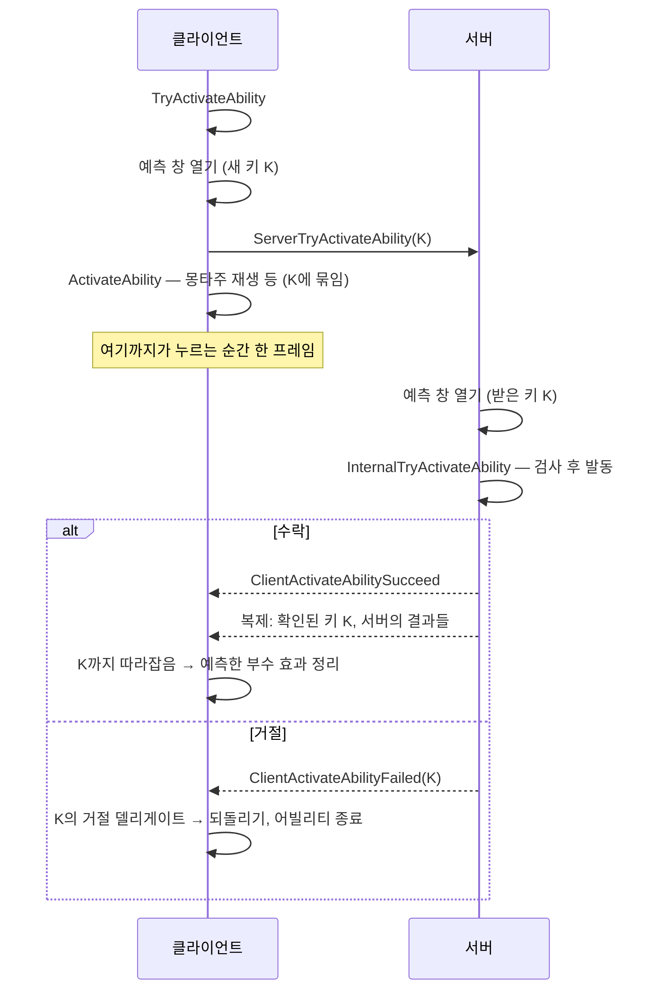
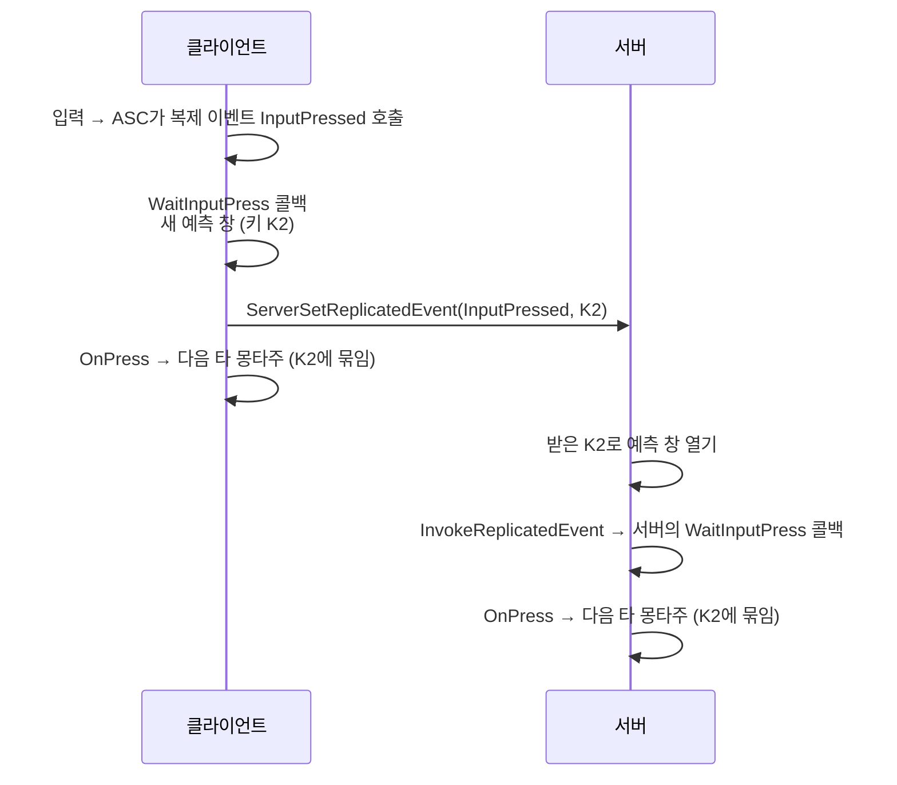

# 010 — GAS 클라이언트 예측

- 기준 엔진: UE 5.8

---

## 1. 한 문장 요약

클라이언트는 서버의 허락을 기다리지 않고 **먼저 실행**하고, 그때 생긴 부수 효과(side effect)를 **예측 키** 하나에 묶어 둔다.
서버가 거절하면 그 키에 묶인 부수 효과를 되돌리고, 수락하면 서버의 복제 결과가 도착할 때 예측한 몫을 치운다.

예측은 **예측 창** 안에서만 일어난다. 창은 RAII 가드라서 스코프가 끝나면 닫히고, 여러 프레임에 걸치지 않는다.

## 2. 왜 예측이 필요한가

[003](003-authority-and-replication.md)의 원칙은 "서버가 진실"이다. 클라이언트가 상태를 바꾸려면 서버에 요청하고 결과를 받아야 한다.

그대로 하면 공격 버튼을 누른 뒤 **왕복 지연(RTT)만큼 지나서야** 칼이 나간다. 100ms면 액션 게임에서는 확실히 느껴진다.

| | 누르는 순간 | 서버 응답 도착 |
|---|---|---|
| 예측 없음 | 요청만 보냄 | 그제서야 몽타주 재생 |
| 예측 있음 | **바로 몽타주 재생** + 요청 보냄 | 수락이면 그대로, 거절이면 되돌림 |

예측은 "서버가 진실"을 포기하는 게 아니다. 서버가 최종 결정권을 가진 채로, **결정이 올 때까지 클라이언트가 결과를 미리 보여주는** 것이다.

## 3. 예측이 풀어야 하는 문제 여섯 가지

엔진 소스의 예측 설명 주석이 문제를 여섯 가지로 나눈다 (`GameplayPrediction.h:52-58`). 이 노트 전체의 지도다.

| 문제 | 질문 | 이 노트 |
|---|---|---|
| 허락 | 이 행동을 해도 되나? | §5 |
| 되돌리기 (Undo) | 거절되면 예측한 것을 어떻게 없애나? | §5, §8 |
| 중복 방지 (Redo) | 서버 결과가 복제로 오면, 이미 예측한 것을 또 하지 않으려면? | §8 |
| 완전성 | 부수 효과를 빠짐없이 예측했나? | §7 |
| 의존 관계 | 예측한 행동이 또 다른 예측 행동을 일으키면? | §10 |
| 덮어쓰기 (Override) | 서버가 소유·복제하는 값을 클라이언트가 미리 바꾸면? | §8 |

## 4. 예측 키 (`FPredictionKey`)

**예측한 행동과 그 부수 효과를 한데 묶는 ID**다 (`GameplayPrediction.h:296-357`).

| 필드 | 의미 |
|---|---|
| `Current` | 키의 고유 번호. 0이면 무효 |
| `Base` | 이 키가 파생된 원래 키 (의존 체인용, 복제 안 함) |
| `bIsServerInitiated` | 서버가 만든 키인가. 서버 키는 **식별용일 뿐 예측에 쓸 수 없다** |

**흐름**

1. 클라이언트가 새 키를 만들어 서버로 보낸다.
2. 클라이언트는 그 키로 부수 효과(몽타주, GE, 태그 등)를 만들면서, 각 부수 효과에 "거절되면 이렇게 되돌려라"를 등록한다.
3. 서버는 받은 키를 **자기 쪽 부수 효과에도 똑같이 붙여** 복제한다.
4. 결과는 둘 중 하나다.

| 결과 | 클라이언트에서 |
|---|---|
| 거절 | 키에 등록된 **거절 델리게이트**가 호출되어 부수 효과를 되돌린다 (`NewRejectedDelegate`) |
| 수락 | 서버가 복제한 "확인된 키"가 이 키까지 **따라잡으면** 예측한 부수 효과를 치운다 (`NewCaughtUpDelegate`) |

**키는 보낸 클라이언트에게만 돌아온다**

`NetSerialize`는 키를 보낸 연결에게만 실제 값을 쓰고, 다른 클라이언트에게는 무효(0)로 보낸다 (`GameplayPrediction.cpp:115-148`, 조건은 `:129`).
다른 클라이언트는 그 행동을 예측한 적이 없으니 키를 알 필요가 없다. 그들에게는 그냥 서버 결과다.

## 5. 어빌리티 발동을 예측하는 흐름

어빌리티 발동은 **명시적으로 서버에 묻고 서버가 명시적으로 답하는** 유일한 예측 행동이다.
나머지 부수 효과는 발동에 딸려 가고 따로 허락받지 않는다 (`GameplayPrediction.h:75-94`).



**클라이언트 쪽** (`AbilitySystemComponent_Abilities.cpp:1925-1960`)

- `FScopedPredictionWindow`로 새 키를 만든다.
- 그 키로 `ServerTryActivateAbility`를 보낸다.
- 응답을 기다리지 않고 바로 `CallActivateAbility`를 부른다.

**서버 쪽** (`:2054-2130`)

- 받은 키로 예측 창을 열고(`:2098`) 똑같이 `InternalTryActivateAbility`를 돌린다.
- `CanActivateAbility` 같은 검사를 **서버가 자기 상태로 다시 한다.** 클라이언트가 통과했다고 서버도 통과하는 게 아니다.

**거절되면** (`:2279-2333`)

- 키의 거절 델리게이트를 모두 방송한다 → 예측한 몽타주 정지, 예측한 GE 제거 등.
- 그 키로 실행 중인 인스턴스를 거절 상태로 표시하고 종료한다.

**수락되면**

- 수락 RPC는 바로 오지만, 서버의 실제 결과(어트리뷰트, GE, 태그)는 **프로퍼티 복제로 따로** 온다.
- 서버의 예측 창이 끝날 때 그 키를 "확인됨"으로 복제 목록에 올린다 (`GameplayPrediction.cpp:514-530`).
- 클라이언트가 그 키까지 받으면 따라잡음 델리게이트가 불리고, 예측으로 만든 임시 부수 효과가 치워진다.
  그 시점에는 서버의 진짜 결과가 이미 도착해 있으므로 화면은 끊김 없이 이어진다.

**테스트:** 콘솔 변수 `AbilitySystem.DenyClientActivations N`을 켜면 서버가 다음 N번의 클라이언트 발동을 일부러 거절한다 (`AbilitySystemComponent_Abilities.cpp:1483-1486`, `:2058-2063`).

## 6. 예측 창

### Prediction Window (예측 창)

예측 창(`FScopedPredictionWindow`)은 RAII 가드다. 생성될 때 ASC의 `ScopedPredictionKey`에 예측 키를 넣고, 파괴될 때 이전 값으로 되돌린다
(`GameplayPrediction.cpp:387-437`, `:484-540`).

```cpp
{
    FScopedPredictionWindow Window(ASC, /*CanGenerateNewKey=*/true);   // 여기서 창이 열린다
    // 이 안에서 만든 부수 효과는 ASC->ScopedPredictionKey에 묶인다
}   // 여기서 창이 닫힌다
```

부수 효과를 만드는 엔진 함수들은 **그 순간의 `ScopedPredictionKey`** 를 가져다 쓴다(`GetPredictionKeyForNewAction`, `AbilitySystemComponent.h:280-283`).
창 밖이면 무효 키를 받는다.

| 부수 효과 | 창 밖(무효 키)에서 클라이언트가 하면 |
|---|---|
| GE 적용 | **아예 적용되지 않는다** — 권한도 없고 유효한 키도 없다 (`AbilitySystemComponent.cpp:455-458`, `:1016-1019`) |
| 몽타주 재생 | 재생은 된다. 하지만 거절 시 되돌리기가 **등록되지 않는다** (`AbilitySystemComponent_Abilities.cpp:3127-3135`) |
| Loose 태그 | 붙는다. 예측 키와 무관하므로 **아무도 되돌려 주지 않는다** |

엔진 주석의 표현: "`ActivateAbility`가 끝나면 예측 창과 예측 키는 더 이상 유효하지 않다. 타이머나 대기 노드가 창을 무효로 만든다. 우리는 여러 프레임에 걸쳐 예측하지 않는다" (`GameplayPrediction.h:77-78`).

### 태스크 콜백은 창 밖이다

어빌리티 태스크의 콜백은 **나중 프레임에** 불린다([008 §7](008-ability-lifecycle-and-tasks.md#7-어빌리티-태스크-왜-필요한가)).
`ActivateAbility`의 호출 스택은 이미 끝났으므로, 콜백 안에서 하는 일은 기본적으로 **예측되지 않는다.**

그래서 "기다렸다가 플레이어 입력에 즉시 반응"하려면 **그 순간 새 창을 열어야** 한다.

### 입력 순간에 새 창을 여는 흐름 — `WaitInputPress`



코드: `AbilityTask_WaitInputPress.cpp:16-46`, `AbilitySystemComponent_Abilities.cpp:3934-3964`.

- 클라이언트 콜백이 **새 창을 열고, 그 키를 서버에 보내고, 곧바로 `OnPress`를 방송**한다. 사이에 다른 일이 끼어들 틈이 없다.
- 서버는 받은 키로 창을 열고 **같은 콜백을 같은 키로** 실행한다. 양쪽 부수 효과가 같은 키로 묶인다.
- 서버의 태스크가 아직 기다리고 있지 않으면 이벤트는 저장되었다가, 태스크가 생길 때 바로 전달된다 (`AbilityTask_WaitInputPress.cpp:72-79`).

엔진 주석은 같은 구조를 `WaitInputRelease`로 설명한다 (`GameplayPrediction.h:194-213`).

### ASC가 입력을 복제 이벤트로 넘겨야 하는 이유 ([008 §4](008-ability-lifecycle-and-tasks.md#4-발동-경로-세-가지)에서 미룬 설명)

`WaitInputPress`는 입력 장치가 아니라 ASC의 **복제 이벤트 `InputPressed`** 를 기다린다.
그런데 엔진의 `AbilitySpecInputPressed`는 실행 중인 인스턴스의 비어 있는 `InputPressed` 함수만 부르고 이 이벤트를 부르지 않는다.
누군가 입력 순간에 `InvokeReplicatedEvent(InputPressed, ...)`를 불러 줘야 위 흐름의 첫 칸이 시작된다.

이 연결이 필요한 이유는 입력 순간에 **새 예측 창을 열 수 있는 지점**을 만들기 위해서다.
입력을 캐릭터 함수로 받아 바로 몽타주를 틀면 창 밖이라 예측되지 않고, 서버에도 같은 키로 전달되지 않는다.

## 7. 무엇이 예측되고 무엇이 안 되나

엔진 주석의 목록 (`GameplayPrediction.h:35-49`)과 제약 (`:218-250`):

| 예측됨 | 비고 |
|---|---|
| 어빌리티 발동 | 첫 발동. 연쇄 발동은 제약 있음(§10) |
| 트리거 이벤트로 인한 발동 | 현재 예측 창의 키를 그대로 쓴다 (`AbilitySystemComponent_Abilities.cpp:2527`) |
| GE 적용 | 어트리뷰트 **모디파이어**, 부여 태그, GameplayCue가 함께 예측된다 |
| GameplayCue | GE 없이 단독 실행도 |
| 몽타주 | |
| 이동 | `CharacterMovementComponent` 자체 예측 |

| 예측 안 됨 | 이유·영향 |
|---|---|
| GE **제거** | 버프 해제 같은 건 서버 결과를 기다린다 |
| GE **주기 효과** (도트 등) | 주기가 있는 GE를 클라이언트가 예측 적용하려 하면 막힌다 (`AbilitySystemComponent.cpp:1021-1033`) |
| **실행 계산**(Execution) | 모디파이어만 예측된다 |
| **메타 어트리뷰트** | `PostGameplayEffectExecute` 같은 반영 훅은 예측 적용에서 불리지 않는다 (`GameplayPrediction.h:230-236`) |
| 연쇄 발동의 되돌리기 | §10 |
| Loose 태그 | 예측 키와 연결되지 않는다. 되돌리기가 없다 |

**완전성 문제**: 이 표에 없는 걸 창 안에서 하면, 클라이언트에서는 실행되지만 거절돼도 남는다.
예측을 믿고 쓰려면 "이 부수 효과가 예측 대상인가"를 알고 있어야 한다.

## 8. 부수 효과마다 되돌리기와 중복 방지를 어떻게 하나

### 몽타주

- 클라이언트가 예측 재생할 때 키의 거절 델리게이트에 "이 몽타주를 멈춰라"를 건다 (`AbilitySystemComponent_Abilities.cpp:3127-3135`).
  거절되면 0.25초에 걸쳐 멈춘다 (`:3257-3270`).
- 서버가 재생한 몽타주 정보(`RepAnimMontageInfo`)는 모든 클라이언트에 복제되지만,
  **로컬 조종 중인 클라이언트는 이를 무시한다** (`:3279-3303`). 자기가 이미 예측 재생했으므로 두 번 틀지 않는다(중복 방지).
- 다른 클라이언트는 서버의 복제 정보로 재생한다.

### GE

(`GameplayPrediction.h:95-112`)

- 클라이언트는 **유효한 예측 키가 있을 때만** GE를 적용한다.
- 만든 `FActiveGameplayEffect`에 키를 저장한다. 서버도 같은 키를 붙여 복제한다.
- 복제로 같은 키의 GE가 오면, 클라이언트는 "적용됨" 계열 처리(Cue 등)를 **다시 하지 않는다**(중복 방지).
- 키가 따라잡히면 예측한 GE를 제거하는데, 이때도 "제거됨" 처리는 하지 않는다. 서버의 GE가 이어받았기 때문이다.
- **즉시(Instant) GE를 예측하면 클라이언트는 무한 지속 GE처럼 취급한다** (`AbilitySystemComponent.cpp:1065-1066`).
  즉시 GE는 적용 후 흔적이 남지 않아 되돌릴 대상이 없으므로, 임시로 남겨 두었다가 키가 정리될 때 없앤다.

### 어트리뷰트 — 덮어쓰기 문제

어트리뷰트는 보통 프로퍼티로 복제된다. 클라이언트가 마나를 100 → 90으로 예측했는데,
서버가 아직 모르는 상태의 100을 복제해 오면 예측이 덮인다.

엔진의 해법은 **절대값이 아니라 변화량(델타)을 예측**하는 것이다 (`GameplayPrediction.h:114-146`).

- 클라이언트는 "마나는 90"이 아니라 "서버 값에 −10"을 예측 모디파이어로 들고 있다.
- 복제된 서버 값을 **최종값이 아니라 기본값(Base)** 으로 받아, 그 위에 예측 모디파이어를 다시 얹어 계산한다
  (`FActiveGameplayEffectsContainer::SetBaseAttributeValueFromReplication`, `GameplayEffect.cpp:3743-3767`).
- 이걸 하는 게 `OnRep`에서 부르는 `GAMEPLAYATTRIBUTE_REPNOTIFY` 매크로다.
- 서버 값이 이전과 같아도 이 재계산이 필요하므로 `REPNOTIFY_Always`를 쓴다. [003 §8](003-authority-and-replication.md#8-현재-코드에-적용된-것)에서 이 옵션을 쓴 또 다른 이유다.

## 9. 네트워크 실행 정책과 예측

| 정책 | 어디서 실행 | 누가 시작 | 예측 | 쓰임 |
|---|---|---|---|---|
| `LocalPredicted` | 로컬 클라이언트 + 서버 | 로컬 클라이언트 | **함** | 반응성이 필요한 플레이어 행동 |
| `LocalOnly` | 로컬 클라이언트만 | 로컬 클라이언트 | 서버가 모름 | 순수 로컬 연출 |
| `ServerInitiated` | 서버 + 소유 클라이언트 | 서버 | 안 함 | 서버가 결정하지만 소유 클라이언트도 로직을 돌려야 할 때 |
| `ServerOnly` | 서버만 | 서버 | 안 함 | 결과만 복제되면 되는 행동 |

**서버에서 시작하는 발동** (`AbilitySystemComponent_Abilities.cpp:1871-1924`)

- 서버는 **서버 키**(`bIsServerInitiated = true`)를 만든다.
- `ServerOnly`가 아니고 로컬 조종이 아니면 소유 클라이언트에 `ClientActivateAbilitySucceed(WithEventData)`를 보내 **거기서도 실행**시킨다. 이벤트 데이터도 함께 간다.
- 서버 키는 예측에 쓸 수 없으므로 **클라이언트 쪽 실행에서 GE를 적용해도 무시된다.** 클라이언트 쪽은 몽타주·연출 같은 로컬 표현을 맡는다.

**클라이언트에서 `ServerOnly`/`ServerInitiated`를 발동하려 하면** 예측 없이 서버에 요청만 보내고 끝난다 (`:1660-1677`).

**트리거로 발동하는 어빌리티**

- 트리거는 서버와 클라이언트에서 **각자** 처리된다. 서버는 클라이언트의 연락을 기다리지 않고 자기 쪽 트리거로 발동한다 (`GameplayPrediction.h:157-163`).
- 누가 트리거로 발동할 권리가 있는지는 정책이 정한다. `LocalPredicted`는 로컬 클라이언트, `ServerInitiated`·`ServerOnly`는 서버 ([008 §4](008-ability-lifecycle-and-tasks.md#4-발동-경로-세-가지)).
- 트리거 이벤트는 **복제되지 않는다.** 서버에서만 보낸 이벤트는 클라이언트가 모른다 (`GameplayPrediction.h:220-221`).

## 10. 예측의 한계와 설계 판단

### 엔진이 인정하는 한계

- **여러 프레임에 걸친 예측은 없다.** 창은 스코프가 끝나면 닫힌다(§6).
- **연쇄 발동은 되돌리기가 불완전하다.** A가 B를 발동하는 연쇄에서, 서버 응답은 순서대로 처리되므로 A가 거절돼도 B가 이미 수락 처리될 수 있다 (`GameplayPrediction.h:223-228`).
  의존 관계를 위해 `Base` 키 개념이 있지만 의존 체인은 클라이언트에만 있고 서버는 모른다 (`:168-190`).
- **메타 어트리뷰트와 실행 계산**은 예측되지 않는다(§7).
- **퍼센트 기반 모디파이어**는 서버가 최종 값만 복제하므로 예측 결과가 어긋날 수 있다 (`:239-247`).
- **서버가 명시적으로 거절하는 건 어빌리티 발동뿐이다.** 발동 뒤에 새 창으로 예측한 로직(입력 순간의 전환 등)은 확인만 되고 거절되지 않으므로, 거절이 꼭 필요하면 별도 어빌리티로 분리한다.

### 무엇을 예측할지 고르는 기준

| 성격 | 예 | 판단 |
|---|---|---|
| **반응성이 핵심** — 늦으면 조작감이 나빠진다 | 공격 모션, 이동, 입력에 대한 즉시 반응 | 예측한다 |
| **결과가 핵심** — 틀리면 게임 상태가 어긋난다 | 판정, 데미지, 사망 | 서버가 결정한다 |
| 틀려도 되돌리기 쉬운가 | 몽타주는 멈추면 된다 | 예측 부담이 작다 |
| 틀리면 되돌리기 어려운가 | 체력 0 → 사망 연출 → 부활 | 예측하지 않는다 |

**판정과 데미지를 서버에만 두는 이유**

- 판정은 다른 캐릭터의 위치에 의존한다. 클라이언트가 보는 상대 위치는 지연만큼 과거다.
- 데미지는 메타 어트리뷰트와 반영 훅을 거치는데, 이 경로는 예측되지 않는다(§7).
- 잘못 예측한 "맞았다"는 되돌리기 어렵다. 피격 모션, 체력 감소, 사망이 줄줄이 따라온다.
- 대신 **맞았다는 느낌(타격감)** 이 늦어진다. 이를 줄이려면 연출만 클라이언트에서 먼저 보여주는 방식을 따로 설계한다.

## 11. 현재 코드에 적용된 것

**어빌리티별 정책**

| 어빌리티 | 정책 | 이유 |
|---|---|---|
| 콤보 [`UBlademasterGameplayAbility_Combo`](../../Source/Blademaster/Combat/BlademasterGameplayAbility_Combo.cpp) | `LocalPredicted` | 누르면 바로 휘둘러야 한다 |
| 피격 [`UBlademasterGameplayAbility_Hit`](../../Source/Blademaster/Combat/BlademasterGameplayAbility_Hit.cpp) | `ServerInitiated` | 서버가 판정 결과로 결정한다. 맞은 쪽이 플레이어면 소유 클라이언트에서도 실행되어 예측 재생 중이던 공격을 끊는다 |
| 부활 [`UBlademasterGameplayAbility_Respawn`](../../Source/Blademaster/Combat/BlademasterGameplayAbility_Respawn.cpp) | `ServerOnly` | 결과(어트리뷰트·태그)만 복제되면 된다 |

- 피격 어빌리티가 소유 클라이언트에서 실행될 때 `ApplyGameplayEffectSpecToSelf`는 서버 키라 적용되지 않는다(§9). 데미지는 서버에서만 들어간다.
- 판정 노티파이는 `HasAuthority()`일 때만 판정을 돌린다. 클라이언트는 판정을 예측하지 않는다(§10).

**입력을 복제 이벤트로 넘기기** — [`UBlademasterAbilitySystemComponent`](../../Source/Blademaster/AbilitySystem/BlademasterAbilitySystemComponent.cpp)

- `AbilitySpecInputPressed`/`Released`를 오버라이드해, 스펙이 활성 상태면 인스턴스의 발동 키로 `InvokeReplicatedEvent`를 부른다.
- 이것이 §6 `WaitInputPress` 흐름의 첫 칸이다.

**콤보의 두 전환 경로와 예측 창**

콤보는 한 타 안에서 두 가지 경로로 다음 타로 넘어간다. 엔진 규칙(§6)에 비추면 두 경로의 예측 여부가 다르다.

| 경로 | 다음 타를 재생하는 곳 | 예측 창 | 결과 |
|---|---|---|---|
| **늦은 입력** — 이어가기 구간 중에 누름 | `WaitInputPress` 콜백 → `OnInputPressed` | **안** (입력 순간 새 창) | 클라이언트와 서버가 같은 키로 전환한다 |
| **선입력** — 미리 눌러 둔 입력을 구간 시작에 소비 | `WaitGameplayTagAdded` 콜백 → `OnComboWindowBegin` | **밖** | 클라이언트와 서버가 **각자 자기 태그 시점**에 판단해 전환한다. 클라이언트의 몽타주에는 거절 시 되돌리기가 없다 |

- 선입력 경로에서 판단 기준인 `Attack.Window.*` 태그는 복제되지 않고 각 기계의 노티파이가 붙인다([009 §6](009-gameplay-tags-in-depth.md#6-태그-복제-기계마다-태그-상태가-다를-수-있다)).
- 또 서버는 입력이 **서버에 도착한 시점의 서버 태그**로 "선입력 구간 안이었나"를 판단한다. 지연만큼 클라이언트가 누른 시점과 다르다.

## 12. 검증 방법

**환경**

- PIE 설정: Number of Players 2, Net Mode `Play As Listen Server`. 클라이언트 창에서 조작해야 예측 경로를 탄다.
  (리슨 서버 호스트는 자기 캐릭터에 대해 권한이 있어 예측하지 않는다.)
- 지연·손실 흉내: 콘솔에서 `Net PktLag=150`, `Net PktLoss=5`. 에디터 설정의 Network Emulation으로도 켤 수 있다.
  지연이 0이면 예측 문제는 거의 드러나지 않는다.

**도구**

| 명령 | 용도 |
|---|---|
| `AbilitySystem.DenyClientActivations 3` | 다음 3번의 클라이언트 발동을 서버가 거절 → 되돌리기 확인 (§5) |
| `showdebug abilitysystem` | 어빌리티·태그·어트리뷰트 상태 |
| `log LogAbilitySystem Verbose` | 발동·종료·거절 로그 |
| `Blademaster.Debug.Combat 1` | 클라이언트 창과 서버 창에서 각자 보는 구간·선입력 상태 비교 |

**볼 것**

- 클라이언트 창에서 누르는 순간 칼이 나가는가 (지연을 줘도)
- 거절시켰을 때 모션이 자연스럽게 멈추는가
- 클라이언트와 서버 창의 타수·구간 표시가 어긋나는 순간이 있는가

## 13. 자주 하는 실수

1. **태스크 콜백에서 한 일이 예측된다고 가정한다.** 콜백은 창 밖이다.
2. **클라이언트에서 GE를 창 밖에서 적용하고 반영되지 않는 이유를 찾는다.** 유효한 키가 없으면 조용히 무시된다.
3. **`ApplyGameplayEffectSpecToSelf`를 직접 부르면서 예측 키를 넘기지 않는다.** 기본 인자가 무효 키다. 어빌리티에서는 `ApplyGameplayEffectSpecToOwner`처럼 키를 알아서 넘기는 함수를 쓴다 (`GameplayAbility.cpp:2061-2069`).
4. **입력을 캐릭터 함수로 받아 몽타주를 바로 튼다.** 서버와 같은 키로 묶이지 않는다.
5. **Loose 태그를 예측용으로 쓴다.** 거절돼도 되돌려지지 않고, 복제된 값과 섞이면 덮인다.
6. **메타 어트리뷰트나 실행 계산으로 만든 결과가 클라이언트에서 즉시 보일 거라 기대한다.**
7. **리슨 서버 호스트 창에서만 테스트한다.** 호스트는 예측하지 않는다.
8. **지연 없이 테스트한다.** 로컬 PIE는 왕복 시간이 거의 0이라 문제가 가려진다.
9. **`OnRep`에서 `GAMEPLAYATTRIBUTE_REPNOTIFY`를 빠뜨린다.** 예측한 어트리뷰트가 서버 값에 덮여 튄다.
10. **`ServerInitiated` 어빌리티의 클라이언트 쪽 실행이 서버와 같은 결과를 낸다고 가정한다.** 클라이언트 쪽은 GE를 적용하지 못하고, 자기가 가진 복제 상태로 판단한다.
11. **GAS 경로를 우회해 부수 효과를 만든다**(`AnimInstance->Montage_Play`, 값 직접 설정). 되돌리기는 `ASC->PlayMontage`나 GE 적용 함수 안에서 등록되므로, 우회하면 거절돼도 남는다.

## 14. 자가 점검 질문

1. 예측이 "서버가 진실" 원칙을 깨지 않는 이유는?
2. 예측 키는 누가 만들고, 어디로 보내지고, 누구에게 돌아오나? 다른 클라이언트는 그 키를 어떻게 보나?
3. 서버가 발동을 거절했을 때와 수락했을 때 클라이언트에서 각각 무슨 일이 일어나나?
4. 예측 창이 RAII 가드라는 것은 무슨 뜻인가? 태스크 콜백은 왜 창 밖인가?
5. `WaitInputPress`가 입력 순간에 서버와 같은 키로 묶이는 과정을 순서대로 설명하라.
6. 이 프로젝트의 ASC가 `AbilitySpecInputPressed`에서 `InvokeReplicatedEvent`를 부르는 이유는?
7. 예측되는 것 네 가지와 예측되지 않는 것 네 가지는?
8. 클라이언트가 즉시 GE를 예측 적용하면 무한 지속처럼 다루는 이유는?
9. 어트리뷰트 예측의 "덮어쓰기" 문제를 엔진은 어떻게 푸나? `REPNOTIFY_Always`와 어떤 관계인가?
10. 서버가 복제한 몽타주 정보를 로컬 조종 클라이언트가 무시하는 이유는?
11. `LocalPredicted`와 `ServerInitiated`의 차이는? `ServerInitiated` 어빌리티의 클라이언트 쪽 실행에서 GE를 적용하면?
12. 판정과 데미지를 예측하지 않는 이유 세 가지는?
13. 콤보의 늦은 입력 경로와 선입력 경로는 예측 창 관점에서 어떻게 다른가?
14. 리슨 서버 호스트 창에서 테스트하면 예측 문제가 드러나지 않는 이유는?

## 15. 엔진 소스 참고 (UE 5.8)

경로 앞부분 `Engine/Plugins/Runtime/GameplayAbilities/Source/GameplayAbilities/`는 `GA/`로 줄인다.

| 파일 | 위치 | 내용 |
|---|---|---|
| `GA/Public/GameplayPrediction.h` | 24-60 | 개요, 예측되는 것·안 되는 것, 여섯 가지 문제 |
| 〃 | 75-94 | 어빌리티 발동 예측 흐름 |
| 〃 | 95-112 | GE 예측 |
| 〃 | 114-146 | 어트리뷰트 예측 (델타, 기본값으로 받기) |
| 〃 | 157-190 | 트리거 이벤트, 의존 체인과 `Base` 키 |
| 〃 | 194-213 | `FScopedPredictionWindow` 설명 |
| 〃 | 218-250 | 미지원·한계 (트리거 복제, 연쇄 되돌리기, 메타 어트리뷰트, 퍼센트) |
| 〃 | 296-357 | `FPredictionKey` |
| 〃 | 479-504 | `FScopedPredictionWindow` 선언 |
| `GA/Private/GameplayPrediction.cpp` | 115-148 | 키 `NetSerialize` — 보낸 연결에만 값 |
| 〃 | 387-437 | 창 생성자 (서버: 받은 키 / 클라이언트: 새 키) |
| 〃 | 484-530 | 창 소멸자 — 서버가 키를 확인됨으로 복제 |
| `GA/Public/AbilitySystemComponent.h` | 280-283 | `GetPredictionKeyForNewAction` |
| `GA/Private/AbilitySystemComponent_Abilities.cpp` | 1483-1486 | `AbilitySystem.DenyClientActivations` |
| 〃 | 1604-1690 | `TryActivateAbility` — 원격 발동 요청 |
| 〃 | 1871-1924 | 서버 발동, 서버 키, `ClientActivateAbilitySucceed` |
| 〃 | 1925-1960 | `LocalPredicted` 클라이언트 발동 |
| 〃 | 2054-2130 | `InternalServerTryActivateAbility` |
| 〃 | 2279-2333 | `ClientActivateAbilityFailed` — 거절 방송, 종료 |
| 〃 | 2367-2410 | `ClientActivateAbilitySucceedWithEventData` |
| 〃 | 2496-2523 | `TriggerAbilityFromGameplayEvent` — 현재 창의 키 사용 |
| 〃 | 3035-3140 | `PlayMontage` — 예측 재생과 거절 델리게이트 |
| 〃 | 3257-3270 | `OnPredictiveMontageRejected` |
| 〃 | 3279-3303 | `OnRep_ReplicatedAnimMontage` — 로컬 조종이면 무시 |
| 〃 | 3934-3964 | `ServerSetReplicatedEvent`, `InvokeReplicatedEvent` |
| `GA/Private/AbilitySystemComponent.cpp` | 455-458 | `HasNetworkAuthorityToApplyGameplayEffect` |
| 〃 | 996-1030 | `ApplyGameplayEffectSpecToSelf` — 권한·키 검사, 주기 GE 예측 금지 |
| 〃 | 1065-1066 | 예측한 즉시 GE를 무한 지속처럼 |
| `GA/Private/GameplayEffect.cpp` | 3743-3767 | `SetBaseAttributeValueFromReplication` |
| `GA/Private/Abilities/GameplayAbility.cpp` | 2061-2069 | `ApplyGameplayEffectSpecToOwner` — 현재 창의 키 전달 |
| `GA/Private/Abilities/Tasks/AbilityTask_WaitInputPress.cpp` | 16-46, 55-80 | 입력 순간 새 창, 서버로 전송, 저장된 이벤트 전달 |
